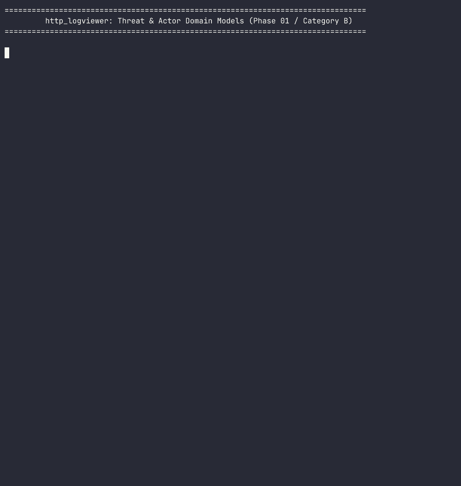
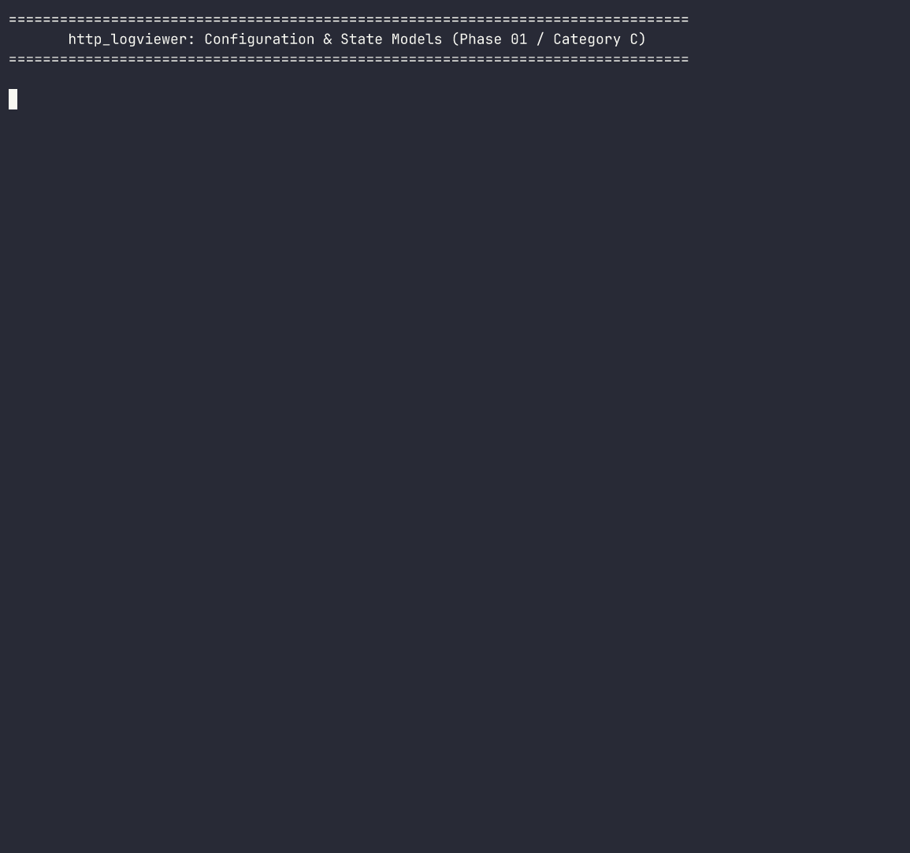
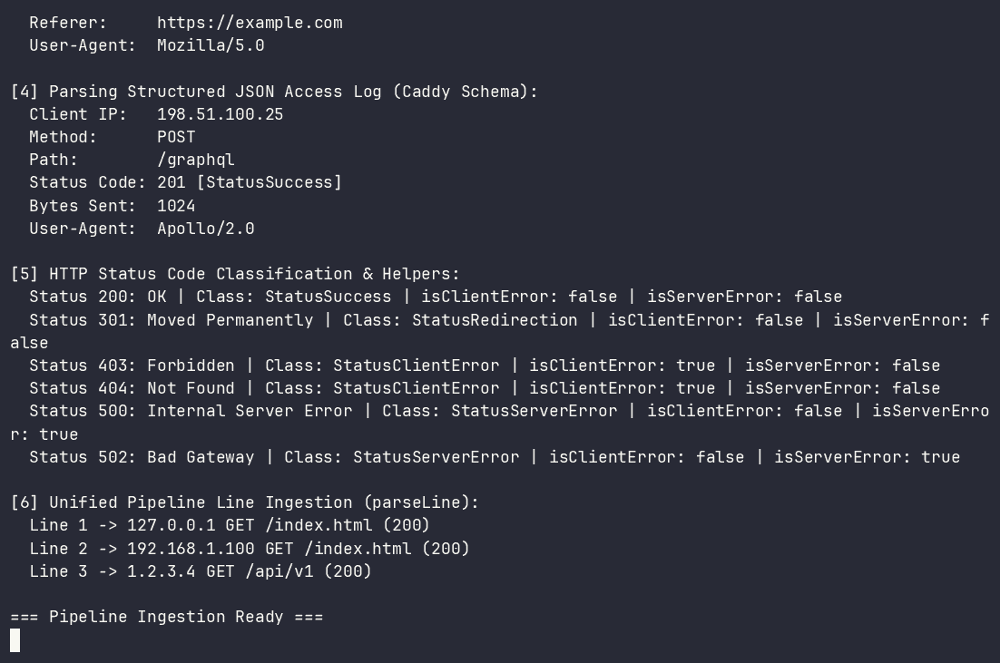
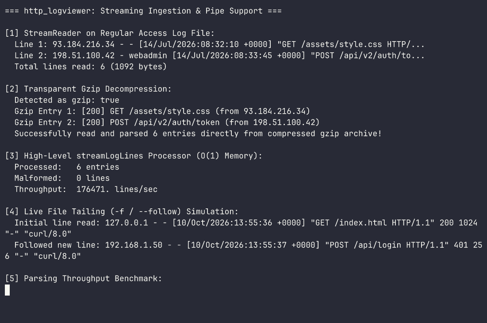
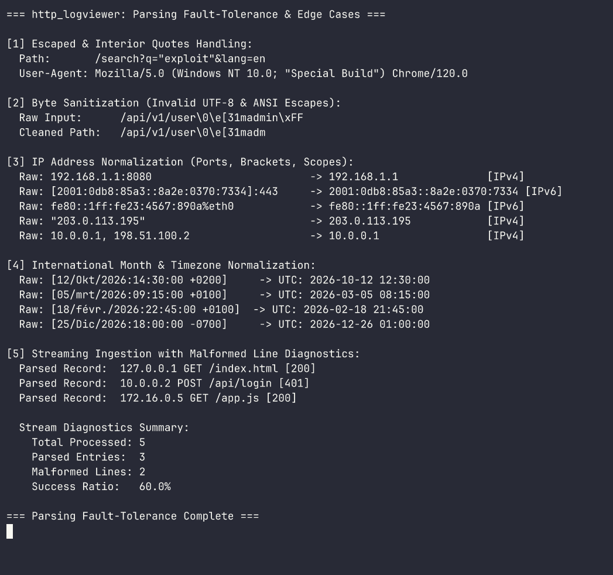
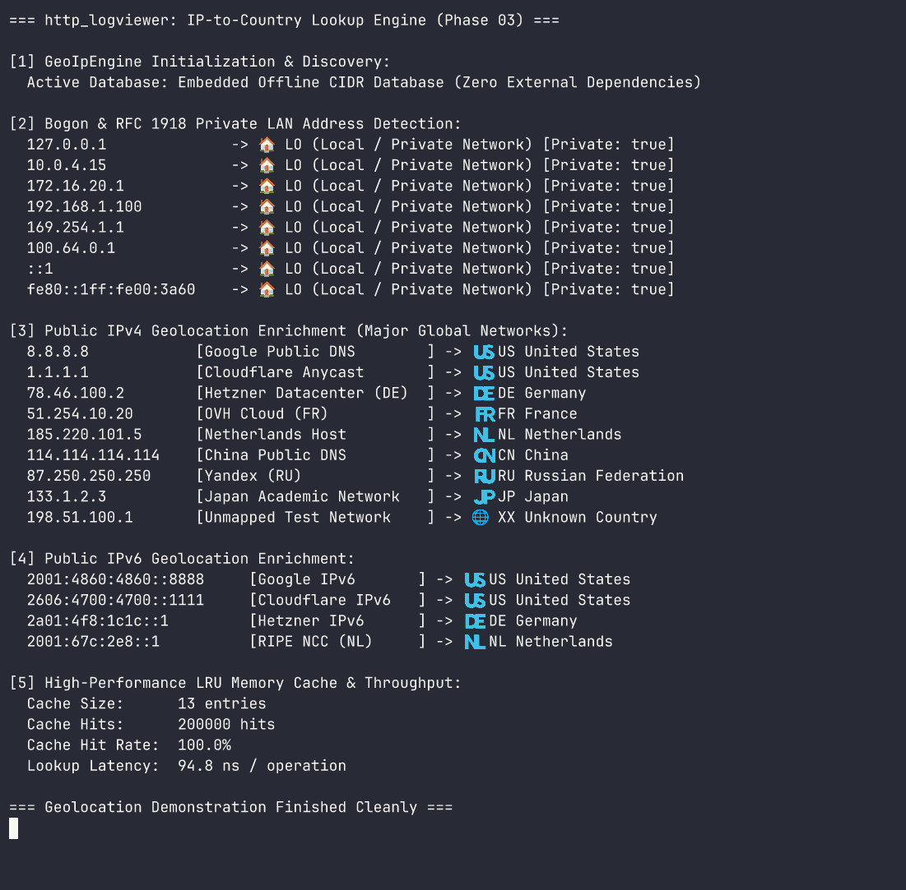

# http_logviewer

High-performance HTTP log viewer and rogue bot detector written in Nim. `http_logviewer` ingests standard HTTP access logs (Common Log Format, Combined Nginx/Apache, Caddy, JSON) and provides real-time enriched terminal output with threat intelligence, country flags, background-colored status badges, and distributed multi-IP actor correlation.

## Key Features

- **Country Flag & GeoIP Enrichment**: Automatically resolves IP addresses to country codes, full country names, and Unicode regional indicator flag emojis (e.g., `🇺🇸 US`, `🇩🇪 DE`, `🇳🇱 NL`, `🏠 LAN`).
- **Visitor Intent Classification**: Instantly distinguishes legitimate human visitors (`REAL_USER`) from verified search engines (`VERIFIED_BOT`), friendly crawlers (`FRIENDLY_CRAWLER`), commercial scrapers (`COMMERCIAL_BOT`), suspicious scanners (`SUSPICIOUS`), and malicious vulnerability probes (`BAD_ACTOR_HACKER`).
- **High-Visibility HTTP Status Badges**: Background-colored ANSI styling to make errors and anomalies instantly identifiable in scrolling logs (bold white on red for `404`, magenta/red for `500`/`502`, yellow for `3xx`, green for `2xx`).
- **Multi-IP Distributed Actor Correlation**: Correlates requests originating from rotating IP addresses and proxies that belong to the exact same botnet campaign or attacker using temporal heuristics, User-Agent telemetry, and probe sequence fingerprinting.
- **Zero External Runtime Dependencies**: Built entirely on Nim's high-performance standard library with low memory overhead and $O(1)$ streaming capability.

---

## Platform Support

`http_logviewer` is tested and supported on:
- **Linux**: Standard POSIX terminal with ANSI/VT220 true-color support.
- **Windows**: Windows Terminal and PowerShell (ANSI escape code support required).
- **macOS**: Terminal.app, iTerm2, and modern POSIX terminal emulators.

---

## Requirements

- **Nim**: Version 2.2.10 or newer (tested with ARC/ORC memory management).
- **Dependencies**: None required for core runtime and CLI.
- **Asciinema & Agg** (Optional development tooling): For recording terminal asciicasts and rendering documentation GIFs.

---

## Architecture Overview

```
                      +-----------------------------+
                      |   HTTP Log Source           |
                      | (File, Pipe STDIN, tail -f) |
                      +--------------+--------------+
                                     |
                                     v
                      +-----------------------------+
                      |  1. Ingestion & Parser      |
                      |  (CLF, Combined, JSON)      |
                      +--------------+--------------+
                                     |
                                     v
                      +-----------------------------+
                      |  2. GeoIP & ASN Enrichment  |
                      |  (ISO Code, Flag Emoji)     |
                      +--------------+--------------+
                                     |
                                     v
                      +-----------------------------+
                      |  3. Threat Classifier       |
                      |  (OWASP Top 10, Scanners)   |
                      +--------------+--------------+
                                     |
                                     v
                      +-----------------------------+
                      |  4. Actor Correlator        |
                      |  (Multi-IP Cluster Engine)  |
                      +--------------+--------------+
                                     |
                                     v
                      +-----------------------------+
                      |  5. Terminal Renderer       |
                      |  (ANSI Badges, Tables, TUI) |
                      +-----------------------------+
```

---

## Table of Contents

- [Platform Support](#platform-support)
- [Requirements](#requirements)
- [Architecture Overview](#architecture-overview)
- [Installation](#installation)
- [Quick Start](#quick-start)
- [API Overview](#api-overview)
  - [Core Log Entry Models](#1-core-log-entry-models)
  - [Threat and Actor Domain Models](#2-threat-and-actor-domain-models)
  - [Configuration and State Models](#3-configuration-and-state-models)
  - [Log Format Detection & Parsers](#4-log-format-detection--parsers)
  - [Streaming Ingestion & Pipe Support](#5-streaming-ingestion--pipe-support)
  - [Parsing Fault-Tolerance & Edge Cases](#6-parsing-fault-tolerance--edge-cases)
  - [IP-to-Country Lookup & GeoIP Enrichment](#7-ip-to-country-lookup--geoip-enrichment)
- [Examples](#examples)
- [Development and Documentation](#development-and-documentation)
- [Attribution and License](#attribution-and-license)

---

## Installation

Clone the repository and build using Nimble:

```bash
git clone https://github.com/titanomachy/http-logviewer.git
cd http-logviewer
nimble build
```

The resulting binary will be placed inside `build/http_logviewer`. All compiler intermediate files are isolated to `build/nimcache/`.

---

## Quick Start

Execute the pre-built test suite to verify all modules:

```bash
nimble test
```

To run a standalone example demonstrating domain model capabilities:

```bash
nim r --path:src examples/threat_and_actor_models.nim
```

---

## API Overview

The library exposes clean, type-safe Nim APIs organized into modular layers:

| Component | Source Module | Primary Types & Concepts | Description |
| :--- | :--- | :--- | :--- |
| [Log Entry Models](#1-core-log-entry-models) | `http_logviewer/core/types` | `HttpLogEntry`, `HttpMethod` | Normalized representation of parsed HTTP log lines, status codes, and HTTP verbs |
| [Threat & Actor Models](#2-threat-and-actor-domain-models) | `http_logviewer/core/types` | `ActorCategory`, `ThreatFlag`, `ThreatProfile`, `ActorCluster`, `GeoLocation`, `EnrichedLogRecord` | Threat intelligence scoring, atomic exploit flags, bot detection, and multi-IP correlation clusters |
| [Configuration & State Models](#3-configuration-and-state-models) | `http_logviewer/core/config`, `http_logviewer/cli/args` | `ViewerConfig`, `FilterCriteria`, `OutputFormat`, `LogFormat`, `ColorMode`, `CliOptions` | Runtime session configuration, granular traffic filtering criteria, format negotiation, and CLI option mapping |
| [Log Format Detection & Parsers](#4-log-format-detection--parsers) | `http_logviewer/parser/formats` | `parseClfLine`, `parseCombinedLine`, `parseNginxLine`, `parseJsonLine`, `parseLine`, `detectLogFormat`, `HttpStatusClass` | High-performance low-allocation parsers for W3C CLF, Nginx/Apache Combined, Caddy JSON, format auto-detection, and HTTP status code token classification |
| [Streaming Ingestion & Pipe Support](#5-streaming-ingestion--pipe-support) | `http_logviewer/parser/engine` | `StreamReader`, `readLineFollow`, `streamLogLines`, `streamRawLines`, `benchmarkParsingThroughput` | Low-allocation streaming ingestion, live file tailing (`-f`), transparent `.log.gz` decompression, and $O(1)$ memory bounds |
| [Parsing Fault-Tolerance & Edge Cases](#6-parsing-fault-tolerance--edge-cases) | `http_logviewer/parser/formats`, `http_logviewer/parser/engine` | `sanitizeUtf8`, `sanitizeControlChars`, `cleanIpAddress`, `normalizeLogDateString`, `ParsingDiagnostics` | Sanitization of invalid UTF-8 bytes and ANSI escapes, interior quote recovery, IPv4/IPv6 port stripping, multi-locale timestamps, and streaming diagnostics |
| [IP-to-Country Lookup & GeoIP](#7-ip-to-country-lookup--geoip-enrichment) | `http_logviewer/enrichment/geoip`, `http_logviewer/enrichment/flags` | `GeoIpProvider`, `GeoIpEngine`, `MmdbGeoIpProvider`, `CidrGeoIpProvider`, `LruCache`, `isoToFlagEmoji` | High-performance IP geolocation, offline MMDB parser, fallback CIDR database, LRU memory cache, and automatic database discovery |
| Error Hierarchy | `http_logviewer/core/errors` | `HttpLogViewerError`, `ParseError`, `ThreatAnalysisError`, `ConfigError` | Robust exception hierarchy derived from `CatchableError` |

---

### 1. Core Log Entry Models

Provides normalized representation of parsed HTTP requests, method parsing, JSON serialization, and set/table interoperability:

```nim
import std/times
import http_logviewer/core/types

let entry = initHttpLogEntry(
  clientIp = "192.168.1.100",
  timestamp = now().utc,
  `method` = HttpGet,
  path = "/index.html",
  statusCode = 200,
  bytesSent = 4096,
  referer = "https://example.com",
  userAgent = "Mozilla/5.0"
)

echo "Single-line format: ", entry
echo entry.pretty()
```

Compile and run this example:
```bash
nim r --path:src examples/log_entry_models.nim
```

---

### 2. Threat and Actor Domain Models

Enables classification of visitor intent, tracking of atomic attack indicators (e.g. SQLi, CMS exploits, path traversal), and correlation of disparate IP addresses belonging to the same distributed botnet:

```nim
import std/[times, sets, options, json]
import http_logviewer/core/types

# 1. Threat scoring
let threat = initThreatProfile(
  score = 92,
  category = CategoryBadActorHacker,
  flags = {ThreatCmsExploit, ThreatSensitiveFile},
  matchedSignatures = @["wp_login_probe", "env_credential_harvest"]
)
assert threat.isHacker()

# 2. Geolocation with flag emojis
let geo = initGeoLocation(
  ip = "185.220.101.5",
  countryCode = "NL",
  countryName = "Netherlands",
  flagEmoji = "🇳🇱"
)

# 3. Multi-IP Actor Clustering
let cluster = newActorCluster(clusterId = "ACTOR-WP-BOTNET", primaryUa = "Masscan/1.3")
let log1 = initHttpLogEntry(clientIp = "185.220.101.5", `method` = HttpPost, path = "/wp-login.php", statusCode = 404)
cluster.addEntry(log1, score = 80, category = CategoryBadActorHacker, flags = {ThreatCmsExploit})

# 4. Enriched pipeline event
let enriched = initEnrichedLogRecord(log1, geo, threat, some(cluster.clusterId))
echo enriched
```

#### Terminal Demonstration

The recording below illustrates visitor categorization, threat profiling, multi-IP cluster tracking, and JSON serialization in action:



> *Source session recording:* [`docs/recordings/threat_and_actor_models.cast`](docs/recordings/threat_and_actor_models.cast) *(recorded with Asciinema, rendered via Agg with JetBrainsMono Nerd Font Mono)*.

Compile and run this example:
```bash
nim r --path:src examples/threat_and_actor_models.nim
```

---

### 3. Configuration and State Models

Manages runtime execution modes, input/output format negotiation, multi-dimensional traffic filtering criteria, CLI option parsing, and bidirectional JSON configuration serialization:

```nim
import std/options
import http_logviewer/core/[types, config]
import http_logviewer/cli/args

# 1. Production defaults
let cfg = defaultViewerConfig()
assert cfg.logFilePath == "-"
assert cfg.colorOutput == true
assert cfg.outputFormat == FormatStreamTable

# 2. Granular filtering criteria
let criteria = initFilterCriteria(
  minThreatScore = 50,
  statusWhitelist = [401, 403, 404, 500],
  countryWhitelist = ["US", "DE", "NL"],
  categories = {CategoryBadActorHacker, CategorySuspicious}
)
assert criteria.allowsStatus(404)
assert not criteria.allowsStatus(200)

# 3. CLI command-line parsing and mapping to ViewerConfig
let cliArgs = ["-f", "--filter=hacker", "--min-score=70", "--group-actors", "/var/log/nginx/access.log"]
let runtimeCfg = parseCommandLine(cliArgs)
assert runtimeCfg.follow == true
assert runtimeCfg.minThreatScore == 70
assert runtimeCfg.enableGrouping == true
```

#### Terminal Demonstration

The recording below illustrates runtime configuration inspection, filter criteria evaluation, CLI flag parsing, JSON round-trip serialization, and validation boundary enforcement in action:



> *Source session recording:* [`docs/recordings/configuration_and_state_models.cast`](docs/recordings/configuration_and_state_models.cast) *(recorded with Asciinema, rendered via Agg with JetBrainsMono Nerd Font Mono)*.

Compile and run this example:
```bash
nim r --path:src examples/configuration_and_state_models.nim
```

---

### 4. Log Format Detection & Parsers

High-performance zero-allocation log parsers supporting W3C Common Log Format (CLF), Nginx and Apache Combined format, structured JSON access logs (Nginx flat and Caddy nested schemas), format auto-detection, and HTTP status code classification:

```nim
import std/options
import http_logviewer/core/[types, config]
import http_logviewer/parser/formats

# 1. Format auto-detection across sample lines
let line = "192.168.1.100 - - [10/Oct/2026:13:55:36 +0200] \"GET /index.html HTTP/1.1\" 200 2326 \"https://example.com\" \"Mozilla/5.0\""
let detectedFormat = detectLogFormatLine(line)
assert detectedFormat == LogFormatCombined

# 2. Parsing Combined format (with Referer and User-Agent)
var entry: HttpLogEntry
assert parseCombinedLine(line, entry)
assert entry.clientIp == "192.168.1.100"
assert entry.statusCode == 200
assert entry.referer == "https://example.com"
assert entry.userAgent == "Mozilla/5.0"

# 3. Parsing structured JSON access logs (supporting Caddy nested and Nginx flat schemas)
let jsonLine = """{"client_ip": "1.2.3.4", "timestamp": "2026-10-10T13:55:36Z", "method": "GET", "uri": "/api/v1", "status": 200, "bytes": 1024}"""
var jsonEntry: HttpLogEntry
assert parseJsonLine(jsonLine, jsonEntry)
assert jsonEntry.clientIp == "1.2.3.4"

# 4. Status code classification and canonical descriptions
assert statusClass(404) == StatusClientError
assert isClientError(404)
assert statusDescription(404) == "Not Found"

# 5. Unified line parser with automatic format detection
var autoEntry: HttpLogEntry
assert parseLine(line, autoEntry, LogFormatAuto)
assert autoEntry.statusCode == 200
```

#### Terminal Demonstration

The recording below illustrates format auto-detection, Common Log Format (CLF) parsing, Combined format parsing with referer/user-agent extraction, Caddy JSON parsing, and HTTP status classification in action:



> *Source session recording:* [`docs/recordings/format_detection_and_parsing.cast`](docs/recordings/format_detection_and_parsing.cast) *(recorded with Asciinema, rendered via Agg with JetBrainsMono Nerd Font Mono)*.

Compile and run this example:
```bash
nim r --path:src examples/format_detection_and_parsing.nim
```

---

### 5. Streaming Ingestion & Pipe Support

Buffered low-allocation stream readers supporting regular log files, STDIN pipes (`tail -f access.log | http_logviewer`), native transparent gzip decompression (`.log.gz`), and live file growth tailing with truncation and rotation recovery:

```nim
import std/[options]
import http_logviewer/core/[types, config]
import http_logviewer/parser/[engine, formats]

# 1. Opening a StreamReader on a regular file, STDIN ("-"), or compressed gzip (.log.gz)
let reader = openStreamReader("access.log.gz")
defer: reader.close()

# 2. Low-allocation line-by-line reading reusing memory buffer
var line = ""
while reader.readLine(line):
  echo "Read log line: ", line

# 3. High-level streaming log line processor with O(1) memory
let stats = streamLogLines(
  "access.log",
  follow = false,
  onEntry = proc(entry: HttpLogEntry) =
    if entry.statusCode >= 400:
      echo "Alert: [", entry.statusCode, "] ", entry.path, " from ", entry.clientIp
)
echo "Streamed ", stats.parsedEntries, " entries in ", stats.elapsedSeconds, "s"

# 4. Live file tailing (-f/--follow) with automatic rotation detection
let tailReader = openStreamReader("/var/log/nginx/access.log")
defer: tailReader.close()

var liveLine = ""
while tailReader.readLineFollow(liveLine, pollIntervalMs = 100):
  echo "Live event: ", liveLine
```

#### Terminal Demonstration

The recording below illustrates `StreamReader` file ingestion, transparent `.log.gz` decompression, live file tailing with real-time append detection, and $O(1)$ memory stream processing in action:



> *Source session recording:* [`docs/recordings/streaming_and_pipe_ingestion.cast`](docs/recordings/streaming_and_pipe_ingestion.cast) *(recorded with Asciinema, rendered via Agg with JetBrainsMono Nerd Font Mono)*.

Compile and run this example:
```bash
nim r --path:src examples/streaming_and_pipe_ingestion.nim
```

---

### 6. Parsing Fault-Tolerance & Edge Cases

Production HTTP access logs frequently contain corrupted character encodings, unescaped interior quotes, proxy port suffixes, multi-locale timestamps, and adversarial injection payloads. `http_logviewer` provides robust sanitization, address normalization, and diagnostics tracking to ensure ingestion never panics:

- **Byte Sanitization & Escaped Quotes**: Cleans invalid UTF-8 byte sequences via replacement or excision, scrubs raw ASCII control characters and ANSI terminal escape codes (`\x1b`), and handles unescaped interior quotes in URI paths and User-Agents using lookahead delimiter heuristics.
- **IPv4 & IPv6 Address Normalization**: Strips port numbers (e.g. `192.168.1.1:8080` or `[2001:db8::1]:443`), removes bracket enclosures, trims network interface scopes (`%eth0`), and extracts the client IP from comma-separated `X-Forwarded-For` proxy chains.
- **Locale Timestamp Normalization**: Normalizes international month abbreviations (German `Okt`, Dutch `mrt`, French `févr.`, Spanish `Dic`) and parses negative timezone offsets (e.g. `[10/Oct/2000:13:55:36 -0700]`).
- **Streaming Diagnostics & Malformed Line Tracking**: Tracks `parsedEntries` and `unparsedLines` counters within `StreamReader` and provides `ParsingDiagnostics` for recording unparseable records with optional stderr warnings.

```nim
import std/times
import http_logviewer/core/types
import http_logviewer/parser/[formats, engine]

# 1. Handling unescaped interior quotes in requests and User-Agents
let raw = "192.168.1.50 - - [10/Oct/2026:13:55:36 +0000] \"GET /search?q=\"exploit\" HTTP/1.1\" 200 1024 \"-\" \"Mozilla/5.0 (\"Special\") Chrome\""
var entry: HttpLogEntry
assert parseCombinedLine(raw, entry)
assert entry.path == "/search?q=\"exploit\""

# 2. IPv4/IPv6 port stripping and bracket removal
assert cleanIpAddress("192.168.1.1:8080") == "192.168.1.1"
assert cleanIpAddress("[2001:db8::1]:443") == "2001:db8::1"
assert isIpv6Address(cleanIpAddress("[2001:db8::1]:443"))

# 3. International month abbreviations and negative UTC offsets
let dt = parseLogDateTime("10/Okt/2026:13:55:36 -0700")
assert dt.utc.hour == 20

# 4. Stream diagnostics tracking malformed lines
var diag = initParsingDiagnostics(warnToStderr = false)
diag.recordSuccess()
diag.recordMalformed("MALFORMED UNPARSEABLE LINE")
assert diag.unparsedCount == 1
assert diag.totalLines == 2
```

#### Terminal Demonstration

The recording below illustrates quote recovery, byte sanitization, IPv4/IPv6 address normalization, international date normalization, and streaming diagnostics tracking in action:



> *Source session recording:* [`docs/recordings/parsing_fault_tolerance.cast`](docs/recordings/parsing_fault_tolerance.cast) *(recorded with Asciinema, rendered via Agg with JetBrainsMono Nerd Font Mono)*.

Compile and run this example:
```bash
nim r --path:src examples/parsing_fault_tolerance.nim
```

---

### 7. IP-to-Country Lookup & GeoIP Enrichment

Every HTTP request is automatically enriched with geographical origin metadata, ISO 3166-1 alpha-2 country codes, English country names, and Unicode regional indicator flag emojis (e.g. `🇺🇸 US`, `🇩🇪 DE`, `🇳🇱 NL`, `🏠 LAN`):

- **GeoIpProvider & GeoIpEngine**: Polymorphic provider architecture supporting MaxMind MMDB files, offline CIDR fallback databases, and LRU-cached backends.
- **Pure Nim Offline MMDB Parser**: Zero-dependency binary parser for MaxMind DB (`.mmdb`) databases (GeoLite2-Country and GeoLite2-City) supporting 24-bit, 28-bit, and 32-bit trees, data section pointer resolution, and metadata auto-parsing.
- **Embedded Offline CIDR Fallback**: Built-in compact subnet database covering major cloud providers and international backbones (Google, Cloudflare, AWS, Azure, Hetzner, OVH, DigitalOcean, Netherlands, China, Russia, Japan, etc.) with zero external file requirements.
- **Bogon & Private LAN Detection**: RFC 1918 subnets (`10.0.0.0/8`, `172.16.0.0/12`, `192.168.0.0/16`), Loopback (`127.0.0.1`, `::1`), Link-Local (`169.254.0.0/16`, `fe80::/10`), CGNAT (`100.64.0.0/10`), and IPv6 ULA (`fc00::/7`) are resolved instantly as `🏠 LO (Local / Private Network)` with zero database overhead.
- **High-Performance LRU Memory Cache**: O(1) in-memory cache with configurable capacity (default 50,000 entries), achieving sub-100ns lookup latency on repeated queries and comprehensive hit/miss statistics.
- **Automatic Database Discovery**: Automatically discovers local MMDB databases across custom paths (`--geoip-db=<path>`), current working directory (`./GeoLite2-Country.mmdb`), and standard system directories (`/usr/share/GeoIP/`, `/var/lib/GeoIP/`, `/etc/GeoIP/`).

```nim
import std/options
import http_logviewer/core/types
import http_logviewer/enrichment/geoip

# 1. Initialize GeoIpEngine with automatic discovery and embedded fallback
let engine = newGeoIpEngine()

# 2. RFC 1918 Private LAN / Bogon detection (zero database overhead)
let privateLoc = engine.lookup("192.168.1.100")
assert privateLoc.isPrivate == true
assert privateLoc.countryCode == "LO"
assert privateLoc.flagEmoji == "🏠"

# 3. Public IPv4 and IPv6 geolocation lookups
let googleLoc = engine.lookup("8.8.8.8")
assert googleLoc.countryCode == "US"
assert googleLoc.flagEmoji == "🇺🇸"

let hetznerLoc = engine.lookup("78.46.100.2")
assert hetznerLoc.countryCode == "DE"
assert hetznerLoc.flagEmoji == "🇩🇪"

let ipv6Loc = engine.lookup("2001:4860:4860::8888")
assert ipv6Loc.countryCode == "US"

# 4. Sub-100ns O(1) LRU memory cache
let cached = engine.lookup("8.8.8.8")
assert engine.cache.hits > 0
```

#### Terminal Demonstration

The recording below illustrates IP-to-Country geolocation enrichment, RFC 1918 private IP detection, public IPv4/IPv6 network resolution, and high-performance LRU memory cache benchmarks in action:



> *Source session recording:* [`docs/recordings/ip_to_country_lookup.cast`](docs/recordings/ip_to_country_lookup.cast) *(recorded with Asciinema, rendered via Agg with JetBrainsMono Nerd Font Mono)*.

Compile and run this example:
```bash
nim r --path:src examples/ip_to_country_lookup.nim
```

---

## Examples

The `examples/` folder provides executable demonstrations of each pipeline layer:

- [`examples/basic_usage.nim`](examples/basic_usage.nim): Baseline library imports and configuration sanity check.
- [`examples/log_entry_models.nim`](examples/log_entry_models.nim): Detailed usage of `HttpLogEntry`, `HttpMethod`, stringifiers, and JSON round-tripping.
- [`examples/threat_and_actor_models.nim`](examples/threat_and_actor_models.nim): Comprehensive threat scoring, geolocation enrichment, and multi-IP cluster correlation.
- [`examples/configuration_and_state_models.nim`](examples/configuration_and_state_models.nim): Runtime session configuration, granular traffic filter criteria, CLI argument parsing, and JSON configuration serialization.
- [`examples/format_detection_and_parsing.nim`](examples/format_detection_and_parsing.nim): High-performance log parsing across CLF, Combined, and JSON formats, format auto-detection, and HTTP status code token classification.
- [`examples/streaming_and_pipe_ingestion.nim`](examples/streaming_and_pipe_ingestion.nim): High-performance streaming ingestion, live file tailing (`-f/--follow`), transparent `.log.gz` archive reading, and $O(1)$ memory processor.
- [`examples/parsing_fault_tolerance.nim`](examples/parsing_fault_tolerance.nim): Robust parsing fault-tolerance, byte and quote sanitization, IPv4/IPv6 address normalization, multi-locale timestamps, and streaming diagnostics.
- [`examples/ip_to_country_lookup.nim`](examples/ip_to_country_lookup.nim): Comprehensive IP-to-Country geolocation, offline CIDR lookups, MaxMind MMDB parsing, LRU cache benchmarks, and bogon LAN detection.
- [`examples/pipeline_scaffolding.nim`](examples/pipeline_scaffolding.nim): Cross-module pipeline event envelope demonstration.

---

## Development and Documentation

Common developer workflows supported by Nimble:

```bash
# Run unit and integration test suite
nimble test

# Run CI sanity check script
nimble ci

# Generate HTML documentation into build/docs/
nimble docs

# Clean all build artifacts and nimcache
nimble clean
```

All build targets, intermediate C files, and generated HTML documentation reside strictly in the `build/` directory.

---

## Attribution and License

- Licensed under the [MIT License](LICENSE).
- Developed in Nim for maximum throughput, low memory footprint, and high-visibility terminal security auditing.
